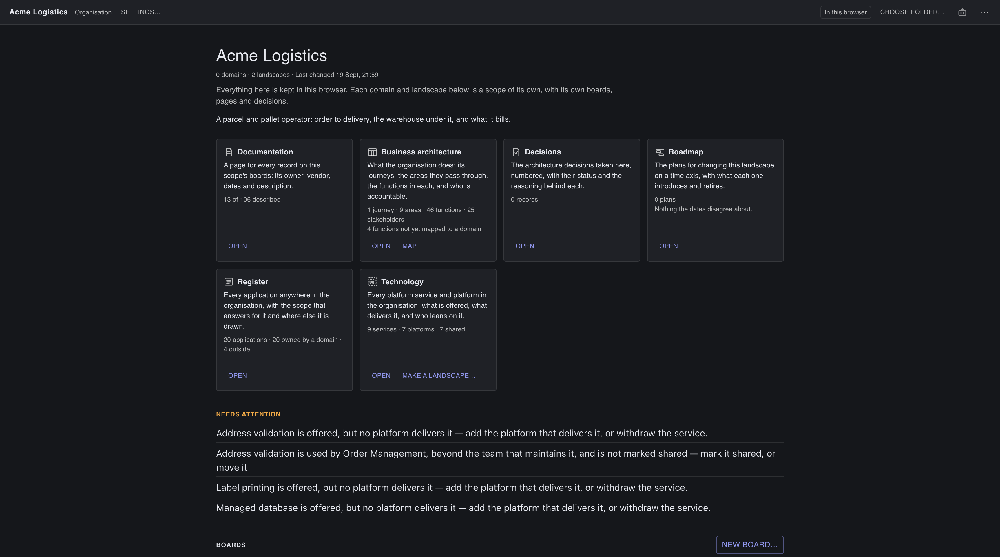
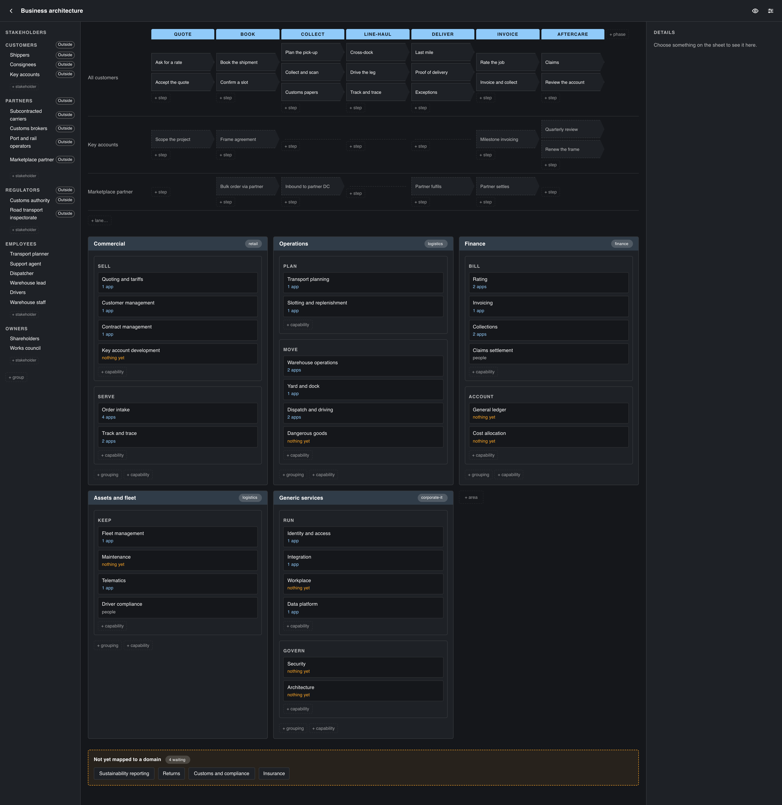

# Benutzerhandbuch

Lionsville Architect zeichnet eine Anwendungslandschaft in Layer-7-Bändern
und die C4-Container-Diagramme darunter. Dies ist das Handbuch für die
Benutzung. Was es ist und warum es existiert, steht in der
[README](../README.md); dieses Handbuch gibt es auch auf
[Englisch](manual.en.md) und [Niederländisch](manual.nl.md).

## Erste Schritte

**Desktop.** Laden Sie die App für Ihre Plattform von
[architecture.lionsville.nl/download](https://architecture.lionsville.nl/download).
Sie sieht im Hintergrund nach, ob es eine neuere Version gibt, und fragt, bevor
sie etwas damit tut — **Download and Install** lädt sie, während Sie
weiterarbeiten, **Skip This Version** sagt: diese nicht, und das
Kontrollkästchen in diesem Dialog schaltet die automatische Prüfung aus. Ist der
Download fertig, bittet die App um einen Neustart; **Later** installiert die
Version beim nächsten Beenden. Wo die App sich nicht selbst ersetzen kann —
direkt vom Disk-Image gestartet oder aus „Downloads“, ohne in „Programme“
verschoben zu sein — sagt sie das und öffnet stattdessen die Download-Seite.
**Check for Updates…** im Hilfe-Menü fragt auf Wunsch nach.

**Die Menüs** auf dem Desktop sind vorerst englisch. **File** hält den Ordner,
die Arbeitsdatei, Schnappschüsse und den Verlauf; seine Einträge zum
geöffneten Bereich — Save — ist ausgegraut, solange nichts geöffnet ist;
Open… und Save a Copy of the Working File… betreffen die ganze Organisation
und funktionieren von jedem Bildschirm aus. **Edit** hält Undo, Redo, Delete und
Select All, die auf den eigenen Rückgängig-Stapel der App und auf die
Zeichenfläche wirken, neben Cut, Copy und Paste. **Help** hält dieses
Handbuch, in der Sprache der App, die Tastenkürzel und die Update-Prüfung.

**Browser.** [app.architecture.lionsville.nl](https://app.architecture.lionsville.nl/)
ist die neueste Version, ohne etwas zu installieren. Sie können sie auch aus
einem Klon des Repositorys starten: einmal `npm run setup`, danach
`npm run dev`, und öffnen Sie <http://127.0.0.1:5200>. Wo der Browser es
anbietet (Chromium tut das), kann ein Tab genau wie der Desktop in einem Ordner
arbeiten. Sonst wird Ihre Arbeit in diesem Browser aufbewahrt; ein privates
Fenster
hält sie nur so lange, wie der Browser es tut. *Wo Ihre Arbeit aufbewahrt
wird* sagt mehr.

In beiden Fällen verlässt nichts Ihren Rechner. Es gibt kein Konto, kein
Backend und keine Telemetrie.

## Der Organisationsbildschirm

Die App öffnet sich auf der **Organisation**: einem Bereich wie jedem anderen,
und dem, unter dem alles andere abgelegt ist, was Sie aufbewahren. Ein **Bereich** ist ein Dokument: ein Name, eine Landschaft, die
Container-Diagramme darunter, die Entscheidungen, die Pläne, die
Geschäftsarchitektur, und alles, was darauf platziert ist. Bereiche sind
**geschachtelt**, und jeder von ihnen ist dasselbe Dokument — die Organisation
ganz oben, eine **Domäne** oder ein **Team** darunter, ein
**Landschaftsbereich** darunter, so tief, wie Ihre Arbeit es braucht. Ein
Landschaftsbereich ist ein Bereich; eine Landschaft ist auch eine Art Tafel,
also eine Zeichnung in einem Bereich.

Der Bildschirm ist das Zuhause der Organisation und keine Liste von
Dokumenten. Eine Zeile unter dem Namen sagt, was er ist und wo alles liegt:
als Dateien im Ordner, in diesem Browser, oder noch nirgends. Dann hat er fünf
Teile.



**Ihre Identität**, ganz oben: der Name, der Auftraggeber, wenn die Zeichnungen
für jemand anderen angefertigt werden, wie viele Bereiche darunter abgelegt
sind, nach dem, was jeder von sich sagt (*2 Domänen · 1 Team*, in den Worten
der Etiketten auf ihren Zeilen), wann sich zuletzt etwas darin geändert hat, die
Beschreibung und ihre Links. Eine Organisation, die noch niemand benannt hat,
fragt hier nach einem Namen, statt eine Überschrift zu zeigen; ein Ordner heißt
wie der Ordner selbst, bis Sie ihm einen Namen geben.

**Ihre eigenen Seiten**, als Karten. Jede sagt in einem Satz, was hinter
**Öffnen** liegt, und zählt dann: **Geschäftsarchitektur** die Kundenreisen,
Gebiete, Funktionen und Beteiligten, die die Organisation selbst hält, und wie
viele Funktionen noch keiner Domäne übergeben wurden; **Entscheidungen** ihre
Einträge nach Status, mit dem neuesten beim Namen; **Fahrplan** ihre Pläne und
das Erste, worüber deren Daten uneins sind; **Register** jede Anwendung im
ganzen Ordner, wie viele davon eine Domäne verantwortet und wie viele jemand
anderem gehören; **Technologie** jeden Plattformdienst und jede Plattform, und
wie viele geteilt sind. Ein Bereich, der zeichnet, hat auch eine Karte
**Dokumentation**. Jede Karte öffnet, was sie zählt; das Schließen der Seite
bringt Sie hierher zurück.

**Braucht Aufmerksamkeit**, unter den Karten, sobald es etwas gibt: ein Satz je
Sache, in der sich die Organisation selbst widerspricht — ein Name, den zwei
Bereiche beide definieren, eine veraltete Kopie, eine Anwendung, von der niemand
gesagt hat, wem sie gehört, ein Dienst, der über eine Teamgrenze hinweg genutzt
wird, ohne als geteilt markiert zu sein, ein Dienst, den keine Plattform
liefert. Jeder Satz ist eine Schaltfläche, die den betreffenden Bereich mit
dem ausgewählten Datensatz öffnet, sodass der Ort zum Beheben einen Klick
entfernt ist. Der Rest von *Ein Name in der ganzen Organisation* weiter unten
sagt, was jeder bedeutet.

**Bereiche in** der Organisation, darunter: eine Zeile je Bereich, die Kinder
eingerückt, mit einem Pfeil, um eine Domäne zuzuklappen, und einem Etikett mit
dem, was der Bereich von sich sagt. Eine Zeile sagt, wie viel darin steckt —
Bereiche mit Tafeln und Diagramme über den ganzen Teilbaum bei einer Domäne,
Diagramme bei einem Bereich, unter dem nichts liegt — und wann sie sich zuletzt
geändert hat. **Reihenfolge** sortiert nach Name oder nach dem, was Sie zuletzt
geändert haben. Eine Organisation, unter der noch nichts abgelegt ist, sagt das
in einem Satz. Ein Bereich, der zeichnet, listet über dem Baum stattdessen seine
**Tafeln**, eine Zeile je Tafel, und **Neue Tafel…** bietet dieselben Arten wie
der `+`-Reiter des Editors: eine Landschaft, eine Geschäftsarchitektur, eine
Unternehmenskarte oder eine Technologielandschaft.

- **Öffnen** auf einer Zeile führt zum Zuhause dieses Bereichs: seine eigenen
  Karten, seine Tafeln und die Bereiche darin, jeder mit einer eigenen Zeile.
  Eine Tafel öffnen Sie über ihre Zeile unter **Tafeln**.
- **Neue Domäne oder neues Team…**, einmal, oben im Abschnitt, fragt nach einem
  Namen und legt den neuen Bereich unter dem Bereich ab, dessen Zuhause Sie
  sehen; **Abgelegt unter** im Dialog legt ihn woanders ab.
- **Einstellungen…** auf jeder Zeile enthält den Namen, was es ist
  (Organisation, Domäne, Programm, Team, Landschaftsbereich — ein Wort für den
  Bildschirm,
  nichts verhält sich anders), einen Auftraggeber, eine Beschreibung, Links und
  **Abgelegt unter**, was ihn verschiebt.
- **Löschen** entfernt den Bereich und alles, was darunter abgelegt ist, und
  die Bestätigung sagt das auch: seinen Ordner auf der Festplatte, oder, in
  einem Browser ohne Ordner, seine Einträge aus diesem Browser. Eine anderswo
  gespeicherte Arbeitsdatei bleibt unberührt. Die Organisation selbst kann nicht
  gelöscht werden: unter ihr ist alles andere abgelegt.

Das Etikett rechts in der Leiste sagt, wo Ihre Arbeit aufbewahrt wird: der
Ordner, in dem Ihre Projekte als Dateien liegen, **In diesem Browser**, oder
**Nirgends gespeichert**. **Aus einem anderen Ordner arbeiten…** daneben
richtet die App auf einen anderen Ordner aus, und ein Browser ohne Ordner
bietet stattdessen **Ordner wählen…**.

**Beispiele**, zuletzt. Eines in eine Organisation zu kopieren, die leer und
unbenannt ist, macht das Beispiel zu *der* Organisation. Eine Organisation, die
schon etwas ist, legt es unter einem eigenen neuen Bereich ab. Das gilt für
alles mit einem Namen, einem Bereich darunter, einer Tafel oder Einträgen, und
für jeden Ordner, der wie der Ordner selbst heißt. So oder so gehört die Kopie
von diesem Moment an Ihnen, und nichts, was Sie tun, wirkt auf das Beispiel
selbst.

Einen Bereich umzubenennen gibt ihm ein neues Label und sonst nichts — wo er
abgelegt ist, ist seine Adresse, und Umbenennen ist kein Verschieben. Einen zu
verschieben ändert die Adresse des Bereichs und von allem darunter und lässt den
Inhalt unberührt: jeder Platzhalter anderswo im Ordner, der hineinzeigte, wird
im selben Schritt an die neue Adresse mitgenommen, sodass ein Verschieben nie
eine Spur veralteter Kopien hinterlässt. Ebenso jede Ursache, die eine seiner
Ursachen erklärt, und jede Beobachtung, die eine seiner Beobachtungen
aufgenommen hat: Sie nennen ihn bei seiner Adresse und gehen mit. Beim Start öffnet die App den Bereich
wieder, den Sie geöffnet hatten.

Sieben Namen werden abgelehnt, weil die eigenen Ordner eines Bereichs sie schon
verwenden: `diagrams`, `docs`, `decisions`, `transitions`, `observations`, `images` und
`logos`.

## Ein Name in der ganzen Organisation

Ein Name bedeutet überall in Ihrem Ordner dasselbe. Das Lagersystem ist ein
System, welche Domäne es auch zeichnet, und eine Fähigkeit, die die Organisation
benennt, ist diese Fähigkeit, wo immer eine Landschaft sie verfeinert — also wird
jedes Ding **einmal** aufgeschrieben, in einem Bereich, und jeder andere Bereich,
der es verwendet, zeigt auf dasselbe.

**Der Bereich, der es aufschreibt, verantwortet es.** Dieser Datensatz trägt die
Details: in welcher Phase es ist und an welchen Daten, wer es verantwortet,
welcher Anbieter es verkauft, worauf es gebaut ist, seine betrieblichen Aspekte. Ändern Sie
davon etwas dort, und überall, wo es gezeichnet wird, steht das Neue.

**Überall sonst steht ein Platzhalter** — eine Karte, die das Ding zeichnet,
ohne es zu verantworten. Ein Platzhalter zeigt seinen Namen mit einer kleinen
Zeile **aus …** darunter, die sagt, wo es wirklich definiert ist, und sein
Inspektor sagt dasselbe mit einer Schaltfläche, um dorthin zu gehen. Sein Name
und diese Zeile sind Kopien, deshalb werden sie schreibgeschützt gezeigt, und
alles in den Details des Eigentümers ebenso; was ein Platzhalter *sehr wohl*
tragen kann, ist **seine eigene Beschreibung** — was das ERP für das Lager
bedeutet, ist eine andere Seite als das, was das ERP ist, und beide sind es wert,
geschrieben zu werden. Ebenso die Farbe, die Form und das Symbol, die Sie ihm
geben, und wo Sie ihn auf Ihren eigenen Boards platzieren.

Welcher Bereich ein Ding verantwortet, entscheidet die **Tiefe**: der tiefste
Bereich, der es aufschreibt. Diese eine Regel funktioniert in beide Richtungen,
und das ist der Punkt. Fähigkeiten werden auf der Organisation geschrieben und
nach unten verfeinert, also behält die Organisation sie. Anwendungen werden in
der Landschaft geschrieben, die sie betreibt, also behält eine Domäne ihre
eigenen — und eine Organisation, die eine Anwendung beim Namen nennt, bevor
jemand sie ausgearbeitet hat, benennt einen Platzhalter, der in dem Moment
beiseitetritt, in dem jemand tiefer den echten Datensatz schreibt.

### Was ein Befund bedeutet

Die App verweigert deswegen nie ein Speichern. Sie liest beim Öffnen den ganzen
Ordner — und wieder, wann immer der Ordner sich unter ihr ändert — und meldet,
was sie findet. Jede Zeile des Baums auf dem Organisationsbildschirm trägt ihre
eigene Zeile.

- **Konflikt** — zwei Bereiche auf derselben Ebene schreiben beide denselben
  Namen auf. Jemand ist mitten in einer Migration, oder zwei Teams haben am
  selben Nachmittag dasselbe Ding benannt. Beide Zeilen sagen es, weil keine von
  beiden die falsche ist. Machen Sie eine zu einem Platzhalter der anderen.
- **Veraltet** — die Kopie des Namens auf einem Platzhalter ist nicht mehr das,
  was der verantwortende Bereich es nennt, oder der Bereich, auf den er zeigt,
  ist umgezogen. **Aktualisieren** schreibt die Kopien in einem Schritt zurück,
  den Sie wie alles andere rückgängig machen können.
- **Undefiniert** — ein Platzhalter für etwas, das nichts im Ordner aufschreibt.
  Die Karte wird gezeichnet und die Zeile behalten; was er braucht, ist
  irgendwo ein Datensatz, auf den er zeigen kann.
- **Eine lose Zeile** — eine Linie, die an etwas endet, das nichts im Ordner
  hält. Behalten und als Stummel gezeichnet, nie von einem Speichern
  weggeworfen.
- **Ein Vorschlag** — eine Fähigkeit, die eine Domäne benannt hat und die kein
  Bereich darüber hat. Kein Fehler: es ist ein Gespräch mit der Ebene darüber.
- **Ohne Eigentümer** — ein System, das als das von jemand anderem markiert ist,
  ohne dass jemand gesagt hat, wessen.

Eines auf der Liste ist **Information und kein Fehler**: ein Datensatz, den kein
Board in seinem eigenen Bereich zeichnet. Ein Ding kann echt, verantwortet und
dokumentiert sein, ohne schon auf irgendjemandes Bild zu stehen, deshalb wird es
getrennt gezählt und nie wie ein Befund eingefärbt.

### Das Register

**Register** auf dem Organisationsbildschirm ist jede Anwendung im ganzen
Ordner, auf einer Seite. Nichts schreibt es: es wird bei jedem Lesen des Ordners
aus den Bereichen selbst gelesen, kann also nicht von dem abweichen, was die
Ordner sagen, und es gibt keine Liste, die zwei Domänen gleichzeitig bearbeiten
könnten.

Jede Zeile sagt, wie die Anwendung heißt, **welcher Bereich sie verantwortet**,
ob sie jemand anderem gehört und wem, **wie viele Bereiche sie zeichnen** (zeigen
Sie auf die Zahl, um ihre Namen zu sehen), und die Befunde dazu als kleine
Chips. Das Filterfeld durchsucht den Namen, den Schlüssel und den Bereich;
**Nach Name** und **Nach Bereich** sind die beiden Reihenfolgen. **Öffnen**
betritt den Bereich, der die Anwendung verantwortet, mit ausgewählter Karte —
dort, wo ihre Details geändert werden können.

Eine Zeile, die sagt, dass zwei Bereiche den Namen beide aufschreiben, bietet
**Verknüpfen…**: es öffnet den Bereich, dessen Datensatz weichen soll, und fragt
dort, weil ein Datensatz nur je von dem Bereich geändert wird, der ihn hält.

### Einen Datensatz zwischen Bereichen verschieben

Wo ein Ding aufgeschrieben ist, ist eine Entscheidung, die Sie nachträglich
ändern können. Wählen Sie die Karte aus und drücken Sie **Verschieben…** im
Inspektor; der Dialog bietet an, welche der vier in Frage kommen.

- **Verknüpfen** — den Datensatz dieses Bereichs aufgeben und für einen
  einstehen, den ein anderer Bereich schon hält. Das ist, was einen Konflikt
  beilegt, und was eine Karte braucht, die gezeichnet wurde, bevor jemand den
  echten Datensatz schrieb. Dieser Bereich behält seine eigene Beschreibung,
  seine Farben und wo die Karte auf seinen Boards sitzt; er gibt die Details
  auf, die der andere Bereich von da an verantwortet.
- **Hochziehen** — den Datensatz in einen Bereich hinaufschieben, unter dem
  dieser abgelegt ist, und hier einen Platzhalter lassen. Was eine in einer
  Landschaft gezeichnete Anwendung braucht, wenn die Domäne darüber diejenige
  sein soll, die sie verantwortet.
- **Abgeben** — das Umgekehrte: ihn in einen Bereich hinunterschieben, der unter
  diesem abgelegt ist.
- **Übergeben** — ihn in einen beliebigen anderen Bereich verschieben. **Hier
  einen Platzhalter lassen** ist standardmäßig angehakt; entfernen Sie den
  Haken, und dieser Bereich zeichnet das Ding gar nicht mehr.

Die letzten drei schreiben **zwei Bereiche**, deshalb fragen sie zuerst. Der
Bereich, in den es geht, wird geschrieben, bevor sich dieser ändert, und das ist
Absicht: geht auf halbem Weg etwas schief, bleibt Ihnen der Datensatz an *beiden*
Stellen — ein Konflikt, den Sie sehen und mit **Verknüpfen** beilegen können —
statt an keiner.

Das ist auch der Grund, warum **Rückgängig dort aufhört**. ⌘Z nimmt alles zurück,
was Sie seither getan haben, und verweigert dann diesen Schritt mit einer Zeile,
die sagt, warum: nur seine Hälfte liegt auf dem Stapel dieses Fensters, und die
andere Hälfte ist eine Datei in einem Bereich, für den hier nichts spricht. Um
ihn zurückzuholen, verschieben Sie den Datensatz erneut in die andere Richtung.

Ein Verschieben wird abgelehnt, mit dem Grund, wenn der Bereich, in den es ginge,
den Namen bereits verantwortet, wenn ein Hochziehen einen Bereich nennt, unter
dem dieser nicht abgelegt ist, und wenn das Entfernen des Datensatzes Dinge, die
darunter abgelegt sind, ohne Halt ließe.

## Wo Ihre Arbeit aufbewahrt wird

Ihre Arbeit liegt an einem von drei Orten, und die Zeile unter dem Namen auf
dem Zuhause der Organisation sagt, an welchem:

- **in einem Ordner**: dem des Desktops, oder dem eines Browser-Tabs, wo der
  Browser einen anbietet;
- **in diesem Browser**: ein Tab ohne Ordner;
- **nirgends**: ein Tab, in dem sich der Speicher des Browsers nicht öffnet.

Die Arbeitsdatei (siehe *Speichern, Exportieren, Weitergeben*) bringt Ihre
ganze Organisation von jedem dieser Orte an jeden anderen.

### Ein Ordner

Beim ersten Start fragt die Desktop-App nach einem **Ordner zum Arbeiten**, und
alles, was Sie anlegen, lebt dort als Dateien, die Sie lesen können:

```
<Ihr Ordner>/
  scope.json                          die Organisation: ihr Name, Auftraggeber, Links
  acme-logistics/                     ein Bereich darunter
    scope.json                        dieselbe Datei noch einmal, eine Ebene tiefer
    warehouse-landscape/              und noch einmal
      scope.json                      wie er heißt, und was er hält
      model.json                      die Elemente und die Linien dazwischen
      diagrams/landscape.json         was ein Diagramm ist
      diagrams/landscape.geometry.json     wo seine Elemente sitzen
      docs/warehouse.md               die Beschreibung eines Elements, als Prosa
      decisions/0007-one-writer.md    ein Entscheidungseintrag
      images/floor-plan.png           ein Bild, das eine Beschreibung zeigt
      logos/own.svg                   ein Logo, das Sie hochgeladen haben
```

Ein Ordner, der eine `scope.json` hält, ist ein Bereich, und die Ordner darin,
die eine halten, sind die Bereiche darunter. Verschieben Sie einen Ordner in
Ihrem Dateimanager, und der Bereich ist an seiner neuen Adresse. Ein Ordner,
dem Sie noch keinen Namen gegeben haben, heißt wie der Ordner selbst.

**Ein Ordner aus einer älteren Version lässt sich öffnen.** Wenn diese Version
zum ersten Mal einen sieht, wandelt sie den ganzen Baum um (`project.json` und
`group.json` werden zu `scope.json`). Auf dem Desktop, wo der Ordner ein
git-Repository ist, hält sie zuerst fest, wie der Ordner vorher aussah. Ein
zweiter Durchlauf tut
nichts.

Nichts ist in der App versteckt. Legen Sie den Ordner in OneDrive, in Dropbox,
auf eine Netzwerkfreigabe oder in ein git-Repository, und er verhält sich so,
wie alles andere dort. **Aus einem anderen Ordner arbeiten…** auf dem
Organisationsbildschirm wechselt in einen anderen Ordner; die Ordner, die Sie
vorher verwendet haben, stehen unter **File ▸ Open Recent Folder**, jeder unter
dem Namen, den seine Organisation sich selbst gibt.

**Alles wird geschrieben, während es sich ändert**: drei Sekunden nachdem Sie
aufgehört haben zu bearbeiten, wenn Sie das Fenster verlassen, und wenn Sie es
schließen. Nur die Dateien, die sich tatsächlich geändert haben, werden neu
geschrieben, sodass das Verschieben eines Elements eine kleine Datei neu
schreibt und sonst nichts. Ein Fenster mit ungespeicherter Arbeit zu schließen
speichert sie zuerst, in jedem Fenster; die App fragt nur, wenn dieses
Speichern nicht geklappt hat.

**Die Arbeit aus dem Browser mitnehmen.** Hat dieser Browser schon Arbeit
aufbewahrt, bevor Sie einen Ordner gewählt haben, fragt die Wahl **Ihre Arbeit
in diesen Ordner mitnehmen?**:
- **Meine Arbeit hineinkopieren** kopiert jeden Bereich, den der Browser
  aufbewahrt hat, in den Ordner. Der Dialog bleibt offen, bis das Kopieren
  fertig ist. Dann sagt er, wie viele Bereiche kopiert wurden, welche nicht,
  und welche er stehen ließ, weil jemand sie inzwischen geändert hat. Bereiche,
  die nicht geschrieben werden konnten, bietet er mit **Erneut versuchen**
  wieder an, und auch beim nächsten Mal, wenn Sie diesen Ordner wählen.
- **Ordner so öffnen, wie er ist** lässt beide, wo sie sind.

So oder so wird nichts gelöscht; der Browser behält seine Kopie.

**Ein Ordner mit einem Remote.** Ist der Ordner ein git-Repository mit einem
Remote, hat *Voreinstellungen* zwei Schalter für diesen Ordner auf diesem
Rechner:
**Beim Öffnen dieses Ordners vom Remote holen** und **Nach jeder Momentaufnahme
pushen**. Sind der Ordner und sein Remote beide weitergegangen, bietet ein
Streifen:
- **Die vom Remote**: die Version des Remotes gilt, und unsere bleibt auf
  einem eigenen Branch erhalten;
- **Unsere behalten**: unsere gilt, festgehalten als Merge auf dem Branch, auf
  dem Sie stehen.

So oder so wird zuerst geschrieben, was offen ist.

**Die eigenen git-Einstellungen des Ordners.** Die App führt git mit Ihrer
eigenen git-Konfiguration aus. Die `.git/config` eines Ordners darf festlegen,
was ein Repository braucht, etwa seine Remotes, seine Branches und wer
committet. Ein Programm, das sie nennt, etwa ein Editor, ein Pager, ein
Signierprogramm oder ein Filter, wird durch Ihren eigenen Wert oder den von git
ersetzt, und Einstellungen nur für Befehle, die die App nie ausführt, etwa ein
Merge- oder Difftool, bleiben, wie sie sind. Ein paar Einstellungen lassen sich
nicht ersetzen und werden abgelehnt: gits eigener Proxy-Befehl, die Programme
für upload-pack und receive-pack, ein Pager für einen einzelnen Befehl, eine
Adressumschreibung und eine Cookie-Datei. In einem Ordner, der eine davon
festlegt, werden eine Momentaufnahme, eine Beschriftung, Holen und Pushen
abgelehnt, und die Meldung nennt die Einstellung, englisch zitiert, wie git sie
meldet, etwa *Die Momentaufnahme ist nicht gelungen: git wurde in diesem Ordner
nicht ausgeführt: its configuration sets http.cookiefile, …*. Dasselbe gilt für
git-lfs, das nur für diesen Ordner eingerichtet ist (`git lfs install` richtet
es für Sie ein, und dann läuft es), und für einen Remote, der ein Ordner
innerhalb des Arbeitsordners ist.

Auch ein Browser-Tab kann in einem Ordner arbeiten, wo der Browser es anbietet
(Chromium tut das). Die Berechtigung überlebt einen Neustart selten, und sie zu
erfragen braucht einen Klick. Deshalb nimmt ein Tab einen gemerkten Ordner nur
wieder auf, wenn die Berechtigung noch erteilt ist, und startet sonst ohne ein
Wort in diesem Browser. Der Desktop ist derjenige, der wählen muss.

### Dieser Browser

Ein Tab ohne Ordner bewahrt Ihre Arbeit in diesem Browser auf, für diese
Website. Das Etikett auf dem Zuhause der
Organisation sagt **In diesem Browser**, und Ihre Arbeit bleibt dort über
Neustarts hinweg, bis Sie oder der Browser die Daten der Website löschen. Nach
dem ersten Speichern bittet die App den Browser, sie auch beim Aufräumen zu
behalten; manche Browser, etwa Firefox, stellen Ihnen diese Frage.
Browser-Speicher ist klein, deshalb sagt die App einmal, wenn er zu etwa vier
Fünfteln voll ist: ein Browser hört ohne Nachfrage auf zu speichern. Hat ein
anderer Tab noch eine ältere Version der App offen, oder wurde die App in
einem anderen Tab aktualisiert, sagt ein Streifen, was Sie schließen oder neu
laden müssen, bevor das Speichern wieder geht.

**Arbeit, die eine ältere Version aufbewahrt hat.** Frühere Versionen haben die
Arbeit eines Browsers an einer anderen Stelle darin aufbewahrt. Diese Arbeit
wird bei jedem Start übernommen: kopiert, nie verschoben, und nie über Arbeit,
die hier seither getan wurde. Hat sich ein Bereich an beiden Stellen geändert,
fragt ein Streifen nach diesem Bereich: **Die ältere Kopie übernehmen** (was
hier ist, geht zuerst in den Verlauf) oder **Behalten, was hier ist**.

**Ein privates Fenster** hält Ihre Arbeit nur so lange, wie der Browser es tut.
Die meisten Browser öffnen ihren Speicher auch dort, also sagt das Etikett **In
diesem Browser**, und alles verschwindet, wenn das Fenster schließt. Die App
kann nicht erkennen, dass das Fenster privat ist: speichern Sie eine
Arbeitsdatei, um Ihre Arbeit zu behalten.

**Wo sich der Speicher des Browsers nicht öffnet**, arbeitet die App aus dem
Arbeitsspeicher, und nichts, was Sie ändern, wird aufbewahrt. Ein Streifen auf
jedem Bildschirm sagt das. Das Etikett auf dem Zuhause der Organisation sagt
**Nirgends gespeichert**, in der Warnfarbe. Die Zeile unter dem Namen sagt
*Alles hier wird noch nirgends aufbewahrt — speichern Sie eine Arbeitsdatei, um
es zu behalten.*, und die erste Momentaufnahme sagt *Momentaufnahmen bleiben
erhalten, solange dieser Tab offen ist, und verschwinden, wenn er geschlossen
wird.* Arbeit, die eine
ältere Version in diesem Browser aufbewahrt hat, wird angezeigt. Speichern Sie
eine Arbeitsdatei, bevor Sie den Tab schließen.

Hat der Speicher des Browsers nach ein paar Sekunden noch nicht geantwortet,
wird die Seite trotzdem gezeichnet. Ein Streifen sagt das, und Ihre Arbeit
erscheint, sobald der Speicher antwortet.

### Wenn es anderswo geändert wurde

Ein Bereich kann sich ändern, während Sie ihn geöffnet haben: der Checkout
eines Kollegen, ein Sync-Client, Sie selbst auf einem anderen Rechner oder in
einem anderen Tab. Die Leiste sagt dann **Anderswo geändert**, oder **Hier und
anderswo geändert**, wenn Sie hier auch ungespeicherte Änderungen haben. Ein
Streifen über der Zeichenfläche fragt, welche Version gilt:
- **Die von anderswo** liest deren Version und zeigt sie an.
- **Meine behalten** spielt Ihre Änderungen auf deren Version nach, sodass
  deren Änderungen an dem, was Sie nicht berührt haben, bleiben. Nur wo das
  abgelehnt wird, schreibt es den ganzen Bereich, wie er auf Ihrem Bildschirm
  ist, über deren Version.
- **Kopie speichern…**, mit ungespeicherten Änderungen hier, legt Ihre zuerst
  in eine Arbeitsdatei und lässt die Entscheidung für später.

Nichts wird ohne Nachfrage überschrieben.

### Wenn ein Bereich nicht ganz lesbar ist

Ist ein Teil eines Bereichs nicht lesbar, weil eine Datei davon beschädigt ist
oder von Hand geändert wurde, öffnet sich der Bereich zum Ansehen und nicht zum
Ändern, und eine Meldung nennt, was nicht lesbar war. Wo Sie dort schreiben
dürfen, wo der Bereich aufbewahrt wird, bietet sie **Eine Arbeitsdatei
einbringen…** an, und **Aus dem Verlauf zurückholen…**, wo ein Verlauf geführt
wird; in einem Ordner sagt sie auch, dass Sie die Datei reparieren und den
Bereich erneut öffnen können.
- **Aus dem Verlauf zurückholen…** öffnet die Seite Verlauf, wo **Den ganzen
  Bereich zurückholen…** den ganzen Bereich zu dem macht, was er bei der
  gewählten Momentaufnahme war. Was nicht lesbar war, wird zuerst aufbewahrt,
  als Eintrag im Verlauf oder neben dem Bereich beiseitegelegt, und wo das
  nicht geht, wird nichts zurückgeholt.
- **Eine Arbeitsdatei einbringen…**, oder eine auf den Bereich zu öffnen, holt
  ihn auf dieselbe Weise aus der Datei zurück, und die Frage davor sagt das.

Ein Eintrag im Verlauf, der aufbewahrt hat, was nicht lesbar war, bietet
**Speichern, was nicht gelesen werden konnte…**, das es als eigene Datei
speichert. Ein Bereich, den eine spätere Version der App geschrieben hat,
öffnet sich nur zum Ansehen: die Meldung sagt, dass Sie die App aktualisieren
sollen, und nichts hier holt ihn zurück.

## Verlauf

Jeder Ort führt einen Verlauf Ihrer Arbeit. **Snapshot…** im Menü File (im
Web im Menü **⋯**: **Snapshot erstellen…**) bietet eine Nachricht an, die schon
aus dem geschrieben ist, was Sie getan haben, etwa „Lagerverwaltung geändert,
3 Elemente verschoben“, und die Sie bearbeiten können, bevor sie festgehalten
wird. Die erste Momentaufnahme bietet **Verlauf führen** an und sagt, wo er
aufbewahrt wird:
- im Ordner selbst, mit git;
- in diesem Browser, für den Ordner eines Tabs (dafür wird nichts in den
  Ordner geschrieben) und für einen Tab ohne Ordner;
- solange der Tab offen ist, wo sich der Speicher des Browsers nicht öffnet.

Nichts verlässt den Rechner, es sei denn, Sie haben für einen Ordner mit einem
Remote **Nach jeder Momentaufnahme pushen** eingeschaltet. Auf dem Desktop
braucht der Verlauf **git** 2.26 oder neuer auf dem Rechner: ohne git wird eine
Momentaufnahme mit einem Satz abgelehnt, der das sagt, und alles andere
funktioniert wie gewohnt.

**Verlauf…** listet jede Momentaufnahme auf. Eine auszuwählen zeigt, was sich
seither geändert hat — Anwendungen hinzugefügt, entfernt und geändert,
Verbindungen gezogen und gekappt, Entscheidungen getroffen — mit der Geometrie
als Zahl statt als Liste, weil ein Aufräum-Durchlauf ein Satz ist und
vierhundert geänderte Zeilen. Eine Verschiebung ist auch ein Eintrag, *Von X
nach Y verschoben*, im Verlauf jedes Bereichs, den sie verschoben hat.

**Der Verlauf eines einzelnen Dings.** Die Auswahl oben auf der Verlaufsseite
grenzt ihn auf ein Diagramm, eine Beschreibung oder eine Entscheidung ein: die
Liste wird zu den Momentaufnahmen, die es berührt haben, und die Änderungen zu
den Zeilen darüber. Dieselbe Seite öffnet sich bereits eingegrenzt über
**Verlauf…** im Reitermenü eines Diagramms, auf der Dokumentationsseite und auf
der Seite einer Entscheidung.

Eine Beschreibung ist das eine Thema, das nicht Sache eines einzigen Bereichs
ist: ein Name bedeutet überall in der Organisation dasselbe, also wird die
Seite eines Elements dort geschrieben, wo es definiert ist, *und* überall, wo
ein Bereich es zeichnet und sagt, was es dort bedeutet. Der Verlauf dieses
Elements ist die Vereinigung dieser Seiten, und eine Zeile unter der Auswahl
nennt die Bereiche, die sie liest. Eine wiederherzustellen bleibt Sache dieses
Bereichs: es setzt zurück, was die Seite dieses Bereichs sagte, und die anderen
gehören jenen zum Wiederherstellen.

**Wiederherstellen.** Mit einer gewählten Momentaufnahme macht **Diese Version
wiederherstellen…** das Diagramm, die Beschreibung oder die Entscheidung wieder
zu dem, was es damals war; wenn das ganze Projekt gezeigt wird, tut **Das ganze
Projekt wiederherstellen…** dasselbe für alles. Eine Wiederherstellung ist eine
neue Änderung über allem, was seither geschah, kein Schritt zurück: der Verlauf
wächst weiter, die Aktivitätsliste sagt *Diagramm Lager wiederhergestellt auf
den Stand vom 3. Sep*, ⌘Z macht es rückgängig, und die nächste Momentaufnahme
hält es fest. Die App bietet diese Momentaufnahme an Ort und Stelle an. Eine
Entscheidung, die angenommen, abgelehnt oder abgelöst wurde, bleibt, wie sie ist
— schreiben Sie eine neue, die sie ablöst — und ein wiederhergestelltes Diagramm
lässt Elemente weg, die nicht mehr existieren, und sagt, wie viele.

**Beschriftungen.** **Beschriften…** auf einer gewählten Momentaufnahme gibt ihr
ein eigenes Wort — „Dem Vorstand gezeigt“ — das neben ihrer Nachricht steht, nie
an ihrer Stelle. Eine Beschriftung reist mit dem Verlauf, sodass ein Kollege
dieselbe Markierung an derselben Stelle sieht; im Ordner des Desktops ist sie
ein git-Tag, den jeder git-Client zeigt. Zwei Beschriftungen mit demselben
Namen werden abgelehnt, überall in einem Ordner und innerhalb eines Bereichs in
einem Browser; wählen Sie ein anderes Wort.

**Momentaufnahmen, die die App selbst macht**, wo ein Verlauf geführt wird:
bevor eine Arbeitsdatei ersetzt, was hier ist, bevor ein Bereich aus dem Verlauf
zurückgeholt wird, und, auf dem Desktop, bevor ein Ordner von seinem Remote
geholt wird und bevor ein Ordner aus einer älteren Version umgewandelt wird.
Jede ist nach dem benannt, dem sie voranging, sodass das, was da war,
wiederhergestellt werden kann.

## Der Arbeitsbereich

Ein offenes Projekt: eine Leiste oben, der Editor darunter.

| In der Leiste | Was es tut |
|---|---|
| **Die Brotkrumen** | Die Organisation, jeder Bereich dazwischen, und der offene fett; jeder ist ein Weg zum Zuhause dieses Bereichs, und der Name der Organisation ist der Weg zurück zum ersten Bildschirm |
| **Einstellungen…** | Der Name dieses Bereichs und wo er abgelegt ist, und seine Standardwerte: der Autor, der auf einem exportierten Diagramm genannt wird, und die betrieblichen Aspekte, mit denen eine neue Landschaft beginnt. Einen Bereich zu verschieben legt ihn unter einem anderen ab und lässt seinen Inhalt unberührt |
| **⋯** | In einem Browser das Menü: **Ordner öffnen…**, wo der Browser einen anbietet, **Öffnen…**, **Speichern**, **Kopie der Arbeitsdatei speichern…**, **Snapshot erstellen…**, **Verlauf…**, **Agent verbinden…**, das Design, **Voreinstellungen…**, und unter Hilfe **Handbuch**, **Tastenkürzel…** und **Desktop-App herunterladen**. Auf dem Desktop stehen dieselben Einträge, bis auf den letzten, in der Menüleiste, mit **Preferences…** als **Settings…** im App-Menü unter macOS |
| **Aktivität** | Was sich an diesem Projekt seit dem Öffnen geändert hat — eine Liste benannter Schritte mit der Uhrzeit jedes einzelnen, und die Verschiebungen, *Von X nach Y verschoben*, und wer sie vorgenommen hat, aus dem Verlauf gelesen, also auch die von vor dem Öffnen. Sie bleibt beim Bereich, wohin er auch geht. Nur lesend: ⌘Z ist der Weg zurück |
| **Gespeichert · hh:mm** | Wo das Projekt steht: die Uhrzeit, zu der es zuletzt geschrieben wurde, oder **Ungespeicherte Änderungen**, **Wird gespeichert…**, **Anderswo geändert**, **Hier und anderswo geändert**, **Nicht gespeichert — Speicher verweigert** |

Alles wird automatisch gespeichert, während Sie arbeiten: drei Sekunden nachdem
Sie aufhören, beim Verlassen des Fensters und beim Schließen. Schließen mit
ungespeicherter Arbeit speichert sie zuerst: der Desktop fragt nur, wenn das
nicht geklappt hat, und ein Browser-Tab fragt, bevor er schließt. In einem
Browser ohne Ordner sagt die App
einmal, wenn ihr Speicher zu etwa vier Fünfteln voll ist. Das ist die einzige
Warnung, die Sie bekommen, weil ein Browser ohne Nachfrage aufhört zu speichern.
Wird ein Speichern verweigert, sagt die Leiste **Nicht gespeichert — Speicher
verweigert**, und der Editor arbeitet weiter. Wo sich der Speicher des Browsers
nicht öffnet, sagt ein Streifen es von Anfang an. Speichern Sie in beiden Fällen
eine Arbeitsdatei, denn sonst ist die Arbeit weg, wenn der Tab geschlossen
wird.
Jede Meldung (gespeichert, geladen, fehlgeschlagen) erscheint in dieser unteren
Leiste.

**Sprache.** Die Sprachschaltfläche rechts in der Werkzeugleiste des Editors
(sie zeigt das Kürzel der Sprache, in der Sie sind: NL, DE oder EN) öffnet
ein Menü der drei: Nederlands, Deutsch und English. Eine zu wählen
schaltet die ganze Oberfläche um: Menüs, Dialoge, Tooltips, Bandnamen,
Fehlermeldungen und den Titelblock eines PNG-Exports. Beim ersten Mal
entscheidet die Sprache des Browsers. Der Entwurf selbst ändert sich nicht;
Elementnamen sind Inhalt, nicht Oberfläche. Frysk wurde bis zum 26. September
2026 angeboten; wer es gewählt hatte, sieht die App jetzt auf Niederländisch.

### Zurück und Vorwärts

**Zurück geht an den Ort, an dem Sie vorher waren**, und Vorwärts an den Ort,
von dem Sie zurückkamen. Ein Ort ist das Zuhause eines Bereichs und die
Seite darauf, oder ein geöffneter Bereich auf seiner Ansicht oder auf der Seite
darüber: seine Entscheidungen, seine Beobachtungen, seine Roadmap, ein Plan,
der Bericht einer Plattform oder eines Dienstes. Jeder Wechsel an einen anderen
Ort ist ein Schritt, ob Sie ihn mit dem Baum, einem Brotkrumen, einer Karte,
einem Suchtreffer oder einem Link auf einer Seite gemacht haben oder ein Agent
ihn für Sie gemacht hat. Hat ein Agent einen Bereich geöffnet, bringt Zurück
Sie dorthin, wo Sie waren. Was ausgewählt ist, der Tag, an dem ein Board
gezeigt wird, ein Filter und ein offener Dialog gehören nicht zu einem Ort, und
einen anderen Eintrag auf der Seite der Entscheidungen oder der Beobachtungen
oder einen anderen Reiter der Beobachtungen zu wählen ist auch kein Schritt:
Die Adresse nennt den offenen Reiter, sodass ein Neuladen auf ihm bleibt. Zurück ist kein Rückgängig: Es bewegt den
Bildschirm und ändert nichts, und ⌘Z bleibt der Weg, eine Änderung
zurückzunehmen.

**Im Browser** tun das Zurück und Vorwärts des Browsers, mit ihren Tasten und
Gesten. Die Adresse nennt den Ort, an dem Sie sind, nach einem `#`, sodass ein
Neuladen dort bleibt und eine aus der Leiste kopierte Adresse denselben Ort für
jeden öffnet, der ihn lesen darf. Der Rest der Adresse bleibt, wie er war.

**In der Desktop-App** beginnt die Leiste mit einer Schaltfläche **‹** und
einer Schaltfläche **›** (unter macOS nach den Schaltflächen des Fensters),
ausgegraut, wenn es nirgendwohin geht. Dieselben Schritte stehen im Menü
**Go** als **Back** und **Forward**, auf **⌘[** und **⌘]** unter macOS und
**Alt+←** und **Alt+→** unter Windows und Linux. Die Zurück- und
Vorwärtstasten der Maus funktionieren auch, ebenso das Wischen zwischen Seiten
auf einem Mac-Trackpad, wenn es auf *Mit zwei oder drei Fingern streichen*
steht (Systemeinstellungen → Trackpad → Weitere Gesten → Zwischen Seiten
streichen). Alle wirken auf dem Zuhause der Organisation ebenso wie mit
geöffnetem Bereich. Solange ein Dialog offen ist, liegen die Schaltflächen
dahinter, und die Tasten, die Menüeinträge und die Maustasten tun nichts. Der
Verlauf gehört zum Fenster: Er ist weg, wenn das Fenster geschlossen wird.

**Zurück schließt einen Dialog**, wenn die Seite verlassen wird, auf der er
geöffnet wurde, so wie wenn Sie die Seite auf anderem Weg verlassen. Darin
getippter Text wird nicht behalten.

**Ein Ort, den es nicht mehr gibt**, wird durch den nächsten ersetzt, den es
gibt: Eine entfernte Ansicht öffnet ihren Bereich auf der ersten Ansicht, die
er noch hat, ein entfernter Eintrag öffnet seine Seite ohne Eintrag, und ein
entfernter Bereich öffnet das Zuhause des nächsten Bereichs darüber. Die
Liste Aktivität sagt, was entfernt wurde.

## Zeichnen

**Die Landschaft** hat fünf Bänder: Akteure, Eingabekanäle, externe Systeme, die
Anwendungslandschaft und die Verwaltungsebene. Ziehen Sie ein Element aus der
Palette links in ein Band, oder klicken Sie mit rechts auf die Zeichenfläche und
**Hier hinzufügen**. Bänder ändern ihre Größe, wenn Sie an ihrer Kante ziehen.

**Domänengruppen** rahmen die Anwendungen ein, die zusammengehören. Fügen Sie
eine aus der Palette oder aus dem Menü der Zeichenfläche hinzu, geben Sie ihr
eine Farbe, ziehen Sie Anwendungen hinein, räumen Sie sie für sich auf. Eine
Gruppe zu entfernen lässt ihre Elemente, wo sie sind.

**Container-Diagramme.** Eine Anwendung kann ein Container-Diagramm unter
sich haben: die Anwendung wird zur Grenze dieses Diagramms, und ihre
Komponenten sitzen darin. Sie legen eines bewusst an — klicken Sie mit rechts
auf die Anwendung und wählen Sie **Container-Diagramm erstellen**, oder drücken
Sie die Schaltfläche dieses Namens auf dem Reiter Allgemein des Inspektors —
und es ist ein Schritt in der Aktivität wie jeder andere, den ⌘Z zurücknimmt.
Eine Karte, die eines hat, trägt eine kleine Marke; doppelklicken Sie die
Karte, um es zu öffnen. Ein Doppelklick legt nie eines an. Ein Landschaftsreiter
listet seine Container-Diagramme unter einem Pfeil: klicken Sie dort mit rechts
auf einen Eintrag, oder drücken Sie den Pfeil hinter dem Namen, sobald das
Diagramm offen ist, um es umzubenennen, seine **Diagrammeinstellungen** zu
öffnen oder es zu löschen. Löschen nimmt die Komponenten mit und lässt die
Anwendung stehen. Klicken Sie mit rechts auf einen Landschaftsreiter für
dasselbe Menü, mit Duplizieren dazu. **Zurück zur Landschaft** bringt Sie
genau zu der Ansicht zurück, die Sie verlassen haben.

Wo diese Container laufen, wird um sie herum gezeichnet: gestrichelte
**Deployment-Rahmen**, einer je Plattform, geschachtelt wie die Plattformen
geschachtelt sind — der Namespace im Cluster im Konto — wobei ein Container,
der auf nichts läuft, außerhalb jedes Rahmens sitzt. Sie werden aus den Zeilen
abgeleitet und lassen sich nicht verschieben: ein Rahmen ist dort, wo seine
Mitglieder sind. Die Schaltfläche **Deployment-Rahmen** in der Werkzeugleiste
nimmt sie weg, wenn jemand das schlichte C4-Bild lesen möchte, und die Ansicht
merkt es sich.

**Dinge finden.** ⌘F / Ctrl+F öffnet den Sucher: Tippen Sie einen Namen, eine
Kategorie, einen Anbieter oder eine Technologie, Enter oder ein Klick wählt das
Element aus, und die Zeichenfläche scrollt dorthin, wobei sie zuerst das
Diagramm wechselt, wenn sie muss. Die Palette hat eine eigene Suche, in beiden
Sprachen.

**Panels.** Ziehen Sie an der Kante zwischen einem Panel und der Zeichenfläche,
um seine Größe zu ändern, doppelklicken Sie die Kante für die Standardbreite,
und verwenden Sie die Pfeile, um ein Panel auf eine Leiste einzuklappen. Die
Schaltfläche für die Übersichtskarte in der Werkzeugleiste zeigt oder verbirgt
die Karte in der Ecke.

**Tastatur.** Tab geht die Elemente auf der Zeichenfläche durch, Enter wählt das
fokussierte aus, und Shift+Enter fügt es der Auswahl hinzu. Die Pfeiltasten
verschieben die Auswahl um einen Rasterschritt, mit Shift um ein Pixel. `?`
zeigt jedes Tastenkürzel.

Verbindungen und die Namen von Domänengruppen liegen auf demselben Weg, und
Enter wählt auch sie aus; Shift+F10 öffnet das Menü dessen, was ausgewählt ist,
und Enter auf dem bereits ausgewählten Element öffnet seine Dokumentation. Eine
Verbindung ziehen Sie ohne Maus mit **Verbindung beginnen zu…** aus dem Menü
eines Elements: mit Tab zum anderen Ende gehen und Enter drücken. Auf dem Tab
einer Landschaft listet ↓ ihre Containerdiagramme, und Shift+F10 öffnet das
Menü des Tabs. Ein Element, ein Band oder eine Gruppe in der Größe ändern, eine
Gruppe verschieben und einer Verbindung einen Knick geben braucht weiterhin
einen Zeiger.

## Elemente

Sieben Arten: Anwendung, Komponente, externes System, Eingabekanal,
Verwaltungswerkzeug, Akteur, und die Domänengruppe, die sie hält — und, seit
der physischen Sicht, eine **Plattform**: ein Cluster, ein Broker, ein Bus,
die Werkzeuge, worauf Anwendungen laufen und was sie nutzen. Wählen Sie
eines aus, und der **Inspektor** rechts zeigt seine Felder in drei Reitern.

- **Allgemein.** Name, Kategorie, Anbieter, Technologie, Lebenszyklus (geplant,
  aktiv, auslaufend, abgeschaltet; als Abzeichen dargestellt, abgeschaltete
  Elemente werden abgeblendet), ob Sie es verwalten, die Beschreibung (siehe
  *Dokumentation*), und wo es sitzt.
- **Darstellung.** Akzentfarbe, Form, Symbol, Symbolgröße.
- **Daten.** Die **betrieblichen Aspekte** einer Anwendung: für jede Spalte dieses
  Diagramms verwaltet, teilweise, keiner oder gefährdet, mit einer Notiz. Die
  Spalten werden je Diagramm in dessen Einstellungen festgelegt.

**Symbole.** Rund hundert eingebaute Marken, durchsuchbar nach Name, Kategorie
und Stichwort in beiden Sprachen, in zwei Größen: klein in der Kopfzeile, groß
als Auftakt der Karte für ein Diagramm, das aus der Entfernung gelesen wird.
**Ein Logo hochladen** in der Auswahl fügt Ihr eigenes SVG oder PNG hinzu (bis
200 kB). Hochgeladene Logos reisen in der Arbeitsdatei mit.

**Mehrere auf einmal.** Wählen Sie mehrere Elemente aus, und der Inspektor
bietet Lebenszyklus, Farbe, Symbol und Domänengruppe für alle, je ein
Rückgängig-Schritt.

**Art ändern.** Klicken Sie mit rechts auf ein Element, **Art ändern ▸**, und
wählen Sie, was es hätte sein sollen; Verbindungen, Beschreibung und Platz
bleiben. Zwei Fälle werden mit dem Grund abgelehnt: eine Anwendung, die ein
Container-Diagramm hat, und eine Komponente, die noch an einer Anwendung hängt.

Elemente gehören zum Modell, nicht zu einem Diagramm: ein Element kann auf
mehreren Diagrammen liegen, und **Aus dem Diagramm entfernen** ist eine andere
Aktion als **Aus dem Modell löschen**. Löschen fragt zuerst und sagt, wie viele
Verbindungen mitgehen.

## Verbindungen

Ziehen Sie vom Anfasser eines Elements zu einem anderen, oder klicken Sie mit
rechts und **Verbindung beginnen zu…**. Eine Verbindung trägt eine Beschriftung,
ein Protokoll (was immer Sie tippen: REST, EDI, Kafka), eine Richtung, die die
Pfeilspitzen setzt, eine Farbe und einen Linienstil. Doppelklicken Sie die
Beschriftung, um sie an Ort und Stelle zu bearbeiten. Sie trägt außerdem eine
Technologie.

**Wo eine Schnittstelle landet.** Die Landkarte zeichnet eine Linie je
Schnittstelle, und wo sie ankommt, liegt eine Ebene tiefer. Öffnen Sie das
Container-Diagramm der Anwendung und greifen Sie das Ende der Linie dort, wo es
den Rahmen berührt: lassen Sie es auf einem Container los, und die
Schnittstelle landet dort — mit ihrem Protokoll. Greifen Sie es erneut, um es
auf einen anderen Container zu verschieben, oder lassen Sie es wieder auf dem
Rahmen los, um die Landung zu entfernen; **Landet auf ▸** im Linienmenü tut
dasselbe ohne Ziehen. Eine zweite Landung ist eine zweite Linie — zeichnen Sie
eine von einem Kontextkasten zu einem Container, und der Inspektor fragt ganz
oben, zu welcher Schnittstelle sie gehört, mit der in dieser Richtung
verlaufenden bereits angehakt.

Sobald eine Schnittstelle gelandet ist, zeigt sie *Detail: 2 Schnittstellen im
Containerdiagramm · REST, AMQP* anstelle ihres eigenen Protokollfeldes, denn
die Protokolle gehören den Landungen — und **Öffnen**, oder ein Doppelklick auf
die Linie selbst, führt dorthin. Container-Linien, die Sie zeichnen, ohne zu
sagen, wozu sie gehören, sind eigenständige Schnittstellen; die Befunde der
Roadmap bieten an, die Linie auf Anwendungsebene dafür zu zeichnen (siehe *Was
die Daten einander widersprechen*).

Linien werden von einem echten Router um Elemente herumgeführt und neu
geführt, wenn sich etwas bewegt. Wenn automatisch nicht das ist, was Sie wollen:

- Ziehen Sie eine **Pille** in der Mitte eines Segments, um dieses Segment zu
  verschieben, ziehen Sie ein **Quadrat**, um einen Knick zu bewegen; die Route
  wird handgezeichnet, und der Router lässt sie in Ruhe.
- **Hier einen Knickpunkt einfügen**, **Knickpunkt entfernen**, **Zurück zur
  automatischen Route** im Linienmenü.
- **Route fixieren** hält eine Linie genau so, wie sie ist, auch eine ohne
  Knicke.
- **Anheften an ▸** wählt, an welcher Seite eines Elements jedes Ende austritt
  oder ankommt, oder halten Sie Alt gedrückt, während Sie eine Verbindung von
  einem bestimmten Seitenanfasser ziehen. Eine gewählte Seite ist eine
  Randbedingung, die der Router einhält, keine handgezeichnete Route.
- Ziehen Sie die Beschriftung von ihrer Standardposition weg;
  **Beschriftungsposition zurücksetzen** bringt sie zurück.

Auf einem sehr vollen Board — mehr als etwa hundertfünfzig Linien, die um einen
Kanal konkurrieren — lehnt das automatische Routing ab, statt Minuten darauf zu
verwenden, und sagt es in der unteren Leiste. Nichts geht verloren: die Linien
behalten die Routen, die sie hatten, und alles, was Sie von Hand gezeichnet
haben, bleibt genau so, wie Sie es hinterlassen haben.

## Layout

**Aufräumen** lässt ein automatisches Layout über das Diagramm laufen, mit einer
Richtung (quer, abwärts, oder Gruppen quer und ihre Anwendungen abwärts), einer
Dichte und Fixierungen für das, was Sie von Hand platziert haben.
**Verbindungen routen** zeichnet nur die Linien neu und lässt jedes Element, wo
es ist; **Alles neu routen** ignoriert Fixierungen. Eine Domänengruppe kann aus
ihrem Menü für sich aufgeräumt werden.

Aufräumen arbeitet neben der App statt in ihr, sodass das Fenster am Leben
bleibt, während es läuft, und die Aufräumen-Schaltfläche derweil zu
**Abbrechen** wird. Auf einem Diagramm mit mehr als vierhundert Kästen lehnt es
ab und sagt es, statt mehrere Minuten nachzudenken: verteilen Sie das Board auf
mehrere Diagramme, oder räumen Sie eine Domänengruppe nach der anderen auf.

Von Hand: eine Auswahl **ausrichten** und **verteilen** aus der schwebenden
Werkzeugleiste oder dem Auswahlmenü, ein **Raster** mit optionalem Einrasten,
Verschieben mit den Pfeilen, **Einpassen** (Shift+1) und 100 % (Shift+2).

## Dokumentation

Jedes Element hat eine Markdown-Beschreibung, und sie kann eine ganze Seite
sein. Öffnen Sie sie als Seite mit **Dokumentation öffnen** im Menü des
Elements, der Ausklapp-Schaltfläche neben dem Beschreibungsfeld im Inspektor,
Enter auf dem ausgewählten Element, oder einem Doppelklick auf alles, was keine
Anwendung ist.

Die Seite öffnet sich zum **Lesen**: das Dokument mit einem Inhaltsverzeichnis,
die anderen Elemente des Diagramms links zum Wechseln (eine Seitenmarke zeigt,
wer schon Dokumentation hat), und die eigenen Felder des Elements rechts.
**Bearbeiten** setzt den Quelltext nach links und das Ergebnis daneben, und macht
auch die Felder rechts bearbeitbar. ⌘B und ⌘I umschließen die Auswahl; Escape
verlässt zuerst Bearbeiten, dann die Seite. Änderungen werden nach einer kurzen
Pause und beim Verlassen gespeichert, ein Rückgängig-Schritt je Pause.

Eine leere Seite kann **mit der Vorlage beginnen**: eine Kopftabelle und die
üblichen Abschnitte. Die Zeile **Kurzbeschreibung** dieser Tabelle ist das, was
das Element auf der Zeichenfläche zeigt; ohne sie ist es der erste Absatz.
`[[Name]]` im Text wird zu einem Link auf dieses Element. Gewöhnliche Links
öffnen sich außerhalb der App.

**Dokumentation** in der oberen Leiste öffnet die Seite des ausgewählten
Elements, oder des ersten Elements auf dem Diagramm, wenn nichts ausgewählt ist.
Ein eingezäunter Codeblock, der auf einer Seite mit `mermaid` markiert ist, wird
als Diagramm gezeichnet. Ein mit `bpmn` markierter Block wird als Prozess
gezeichnet: BPMN 2.0 XML, wie die gängigen Modellierungswerkzeuge es speichern,
mit einem eigenen Diagrammabschnitt, der sagt, wo alles steht — Pools und
Lanes, Tasks, Ereignisse, Gateways, Flüsse und Nachrichten, schreibgeschützt.
Die Seite eines Prozesselements ist der Ort, wo einer hingehört (seine
`realises`-Zeile sagt, für welche Fähigkeit er das Wie ist), und eine Datei ohne
Diagrammabschnitt wird als Text unter einer Zeile gezeigt, die sagt, warum.

**Bilder.** Fügen Sie ein Bild in den Text ein oder ziehen Sie es hinein, um es
hinzuzufügen: PNG, JPEG, SVG oder WebP. **Bilder** neben der Quelle listet jedes
Bild, das der Bereich hält, mit **Einfügen**, um eines auf diese Seite zu
setzen, und **Bild löschen**, um eines zu entfernen. Der Text nennt ein Bild
bei seinem Namen, ``, wo auch immer
der Bereich aufbewahrt wird. Eine Seite legt alle Bilder sofort in ihrer
eigenen Größe an und holt eines erst, wenn es ins Bild scrollt. Eine lange
Seite öffnet sich also schnell, und nichts auf ihr verschiebt sich, wenn die
Bilder ankommen. Ein Bild, das nicht gezeigt werden kann, zeigt seine
Bildunterschrift. Nur Bilder, die beim Bereich aufbewahrt sind, werden
gezeichnet: eine Webadresse erscheint als Bildunterschrift, und die App holt
nie etwas.

## Entscheidungen

**Entscheidungen** in der oberen Leiste öffnet die Architekturentscheidungen
(Architecture Decision Records): ein Baum links, die Einträge des ausgewählten
Knotens in der Mitte, und der Eintrag, den Sie lesen, rechts.

Die Einträge dieses Bereichs sind **eine Liste**. Ein Eintrag gehört entweder
zum Bereich als Ganzem, oder er handelt von einem Ding darin — einer Anwendung,
einer Fähigkeit, einem Schritt einer Kundenreise — und der Baum hat einen Knoten
für jedes Ding, das Einträge hat, wobei jede Anwendung aufgeführt wird, ob sie
schon welche hat oder nicht. Etwas, das das Modell verlassen hat, behält seine
Einträge unter *Entfernte Anwendungen*.

Darunter kommen die Bereiche **über** diesem, je als ein Abschnitt: *Von Acme
Logistics*, *Von Retail*. Ihre Einträge werden hier gelesen und **dort
geändert, wo sie liegen** — der Leser zeigt sie ohne Bearbeiten-Schaltfläche und
bietet stattdessen an, diesen Bereich zu öffnen. Die Nummerierung ist je
Bereich, sodass ADR-0001 der Domäne und ADR-0001 der Landschaft zwei Einträge
sind und es immer waren.

Ein Eintrag folgt dem MADR-Format: Kontext und Problemstellung,
Entscheidungsfaktoren, die betrachteten Optionen, das Ergebnis und seine
Konsequenzen, die Vor- und Nachteile jeder Option, weitere Informationen. **Neue
Entscheidung** fragt nach dem Titel und beginnt den Text mit dieser Vorlage.
Titel, Status, Datum und Entscheidungsträger sind Felder über dem Text; die
Tabelle **Prüfer und Unterschriften** am Ende listet auf, wem die Entscheidung
vorgelegt wurde, jeweils mit einem Urteil und dem Tag, an dem es gefällt wurde.

Der Status ist ein Arbeitsablauf, kein Label. Ein Eintrag beginnt als
**Vorgeschlagen**, geht **In Prüfung** und wird dann **Angenommen** oder
**Abgelehnt**. Diese beiden sind das Ende des Weges: von dort an kann der
Eintrag nicht mehr bearbeitet oder gelöscht werden, denn eine Entscheidung, die
sich nachträglich umschreiben lässt, ist kein Protokoll einer Entscheidung. Ein
angenommener Eintrag kann später **Abgelöst** werden, was nach dem Eintrag
fragt, der ihn ersetzt, und den Verweis in beide Richtungen zeigt. Eine Prüfung
kann auf Vorgeschlagen zurückgesetzt werden.

Das Suchfeld über der Liste durchsucht jeden Eintrag im Baum auf einmal — Titel,
Text und Prüfer, die dieses Bereichs und die der darüberliegenden. Texte sind
Markdown, mit denselben `[[Name]]`-Links wie die Dokumentation; **Hilfe zur
Formatierung** neben dem Quelltext zeigt die Syntax, Mermaid-Diagramme
eingeschlossen. Änderungen werden mit diesem Bereich gespeichert.

## Beobachtungen

**Beobachtungen** in der oberen Leiste öffnet, was das Team in diesem Scope
gesehen hat — und, im Team analysiert, was dahintersteckt. Die Seite hat drei
Reiter. Das **Register** ist eine Tabelle, die aus den Datensätzen gelesen
wird: Nummer, Titel, der Tag, an dem es zuerst gesehen wurde, wo, die
Auswirkung, wie oft es gesehen wurde und die Ursachen, zu denen es analysiert
wurde; darunter die Ursachen, die Lösungen und die Experimente; der gewählte
Datensatz öffnet sich daneben. Die **Analyse** ist ein Bild: die
Beobachtungen links, die Ursachen, zu denen sie analysiert wurden, in den
Bahnen rechts davon, dann die Grundursachen, und die Lösungen, die sie
angehen, zuletzt. Der dritte Reiter, **Lösungen**, folgt unten.

**Lokal und global.** Die Beobachtungen, Ursachen, Lösungen und Experimente
eines Scopes gehören ihm. Aus einem Scope gelesen sind die der Scopes
darunter **lokal** in jenen Scopes; aus der Organisation gelesen ist, was der
Organisation selbst gehört, die **globale** Analyse. Um dorthin zu kommen,
wird nichts geteilt: Ein Scope liest die Analyse jedes Scopes darunter, und
wer einen Scope lesen darf, wird dort entschieden, wo die Arbeit aufbewahrt
wird, nie an einem Datensatz. **Lokal zeigen**, neben den anderen
Bedienelementen des Bildes, ist an, wo der Scope Scopes darunter hat, und aus
— mit dem Grund dazu —, wo er keine hat. An zeichnet das Bild jeden Scope
darunter in einem eigenen Rahmen links von den Bahnen dieses Scopes,
verschachtelt wie der Baum, und das Register, die Ursachen, die Lösungen und
die Experimente führen die Datensätze jedes Scopes darunter nach denen dieses
Scopes auf, unter *Lokal in …*. Die Zahlen über dem Bild — beobachtet,
analysiert, angenommen, verifiziert, Grundursachen, offene Enden — zählen,
was das Bild zeigt, die Scopes darunter eingeschlossen. Aus zeigt die Seite
nur diesen Scope und sagt, wie viele lokale Einträge sie ausblendet.

Ein Datensatz eines Scopes darunter wird **dort geändert, wo er lebt**. Sein
Leser sagt das in einem Streifen — *Lokal in Application landscape* — mit
einer Schaltfläche darunter, die die Seite jenes Scopes öffnet. Was Sie von
hier aus hinzufügen — eine Sichtung, eine Ursache, eine tiefere Ursache, eine
Verknüpfung zwischen seinen eigenen Datensätzen, eine seiner Ursachen zur
Grundursache machen —, wird in jenem Scope angelegt und dort sofort gespeichert, als Änderung jenes
Scopes und nicht dieser Seite: Ein Hinweis danach sagt, wohin es ging, und ⌘Z
auf dieser Seite reicht nicht hin — zurücknehmen heißt, es zurückzuändern. Wo
jener Scope von hier aus nicht geändert werden darf, oder seine eigenen
Regeln die Änderung ablehnen, sagt der Hinweis, dass nichts angelegt wurde.
Eine Lösung oder ein Experiment eines Scopes darunter wird hier gelesen und
nicht geändert.

Eine Beobachtung ist ein nummerierter Datensatz (`OB-0007`) mit Titel, Ort,
wer sie gemacht hat — freier Text: ein Name, Initialen, ein Team —, dem Tag,
an dem es zuerst gesehen wurde, einer Auswirkung — *gering*, *erheblich* oder
*kritisch* — und einem Markdown-Text für das Gesehene, die Belege und wen
oder was es betraf. **Erneut gesehen** zählt eins dazu und schreibt den Tag
in die **Geschichte** des Datensatzes: das datierte Verzeichnis am Ende jeder
Beobachtung — festgehalten, erneut gesehen, zusammengeführt, archiviert. Auf
einer großen Karte ist die Auswirkung ein Streifen am linken Rand und die
Zahl steht in der Ecke; auf einer kleinen ist die Auswirkung die Größe des
Kreises.

**Neue Beobachtung** fragt nach den vier Fakten, die eine Beobachtung
ausmachen: dem Titel, **wo es gesehen wurde**, **beobachtet von** und
**wann gesehen**. Wann gesehen beginnt mit heute und darf nicht in der
Zukunft liegen; die Auswirkung beginnt mit gering. Rechts stellt die
Beschreibung ihre drei Fragen, ein Feld je Frage — **was wir gesehen haben**,
**Belege** und **wen oder was es betraf** —, und die letzte ist ebenfalls
Pflicht: Eine Beobachtung sagt immer, wen oder was sie betraf. Festgehalten
sind die drei ein Markdown-Text unter diesen Überschriften, und danach wird
die Beschreibung einer Beobachtung als ein Text bearbeitet. **Vorschau** zeigt
sie so, wie sie gelesen wird, und **Bearbeiten** geht zurück zu den Feldern.
Unter jedem Feld steht ein Beispiel, und ein leer gelassenes Feld sagt an
dieser Stelle, was fehlt. Unter dem Titel stehen
zwei Hinweise, die nie aufhalten: **Schon einmal gesehen?** nennt
Beobachtungen des gewählten Scopes, deren Titel Wörter mit Ihrem teilt, jede
mit **Erneut gesehen**, das eine Sichtung an jener festhält und nichts Neues
anlegt; und ein Titel mit einem Wort, das nach einer Ursache, einer Abhilfe
oder Schuld klingt — *weil*, *sollte*, *beheben*, *Schuld* —, erhält den
Hinweis, beim Gesehenen zu bleiben und das Warum in eine Ursache zu setzen.
Mit Lokal zeigen fragt das Formular zuerst, in welchen Scope die Beobachtung
gehört; einer darunter macht sie dort lokal.

Die **Ursachen** können mit der Beobachtung geschrieben werden. **Neue
Ursache** öffnet die Felder einer Ursache im Formular — den Titel, *warum
wir das annehmen*, ob es eine Grundursache ist, und wie stark sie die
Beobachtung erklärt — mit *Schon aufgeschrieben?* über den Ursachen des
Scopes. **Vorhandene Ursache** wählt eine, die schon aufgeschrieben ist. Jede
Zeile sagt, ob sie neu oder vorhanden ist, und lässt sich wieder
herausnehmen, und nichts wird angelegt, bis Sie erfassen: Die Schaltfläche
sagt, was sie anlegen wird, *Beobachtung erfassen mit 1 neuen Ursache und 1
Verknüpfung*, und es ist ein Schritt — ⌘Z nimmt die Beobachtung, die neuen
Ursachen und die Verknüpfungen zusammen zurück. Ein anderer Scope nimmt die
Verknüpfungen zu Ursachen des vorher gewählten heraus und sagt das.

Beobachtungen, die sich als dasselbe erweisen, werden **zusammengeführt**,
und Ursachen, die zweimal aufgeschrieben wurden, ebenso. **Zusammenführen…**
an einer Beobachtung oder einer Ursache — im Leser, per Rechtsklick oder an
einer eines Scopes darunter — öffnet die **Zusammenführungsansicht** über der
Seite, mit diesem Datensatz gewählt. Sie hat drei Teile:

- **Was zusammengeführt wird.** Eine Suche über die lebenden Beobachtungen,
  oder die nicht zusammengeführten Ursachen, dieses Scopes; mit **Über Scopes
  hinweg** wird in jedem Scope gesucht, den Sie lesen können, der nächste
  zuerst, und jeder Treffer nennt seinen Scope. Haken Sie so viele an, wie
  dasselbe sind. Einer der gewählten **bleibt bestehen**; bis Sie einen
  anderen wählen, ist es der, von dem Sie ausgingen. Ein Datensatz eines
  Scopes, den Sie lesen und nicht ändern dürfen, wird aufgeführt, kann nicht
  angehakt werden und sagt, warum.
- **Was der bleibende Datensatz sagt.** Eine Zeile je Wert — für eine
  Beobachtung der Titel, wo, beobachtet von, die Auswirkung und der Tag des
  ersten Sehens, der beim frühesten der gewählten beginnt; für eine Ursache
  der Titel, angenommen oder verifiziert, und ob sie eine Grundursache ist.
  Daneben ist der Wert jedes gewählten Datensatzes eine Schaltfläche, die ihn
  ins Feld setzt, oder Sie geben Ihren eigenen ein. Die Sichtungen werden
  addiert, nicht gewählt. Die Beschreibung ist die des bleibenden
  Datensatzes, bearbeitbar; **Die Beschreibungen der anderen hinzufügen**
  hängt die jedes anderen an, unter *Zusammengeführt aus OB-0007* (mit seinem
  Scope, wo das ein anderer ist). Die anderen behalten ihre eigene
  Beschreibung in jedem Fall.
- **Was mitgeht.** Jede Verknüpfung, die einen zusammengeführten Datensatz
  nennt, eine Zeile je, angehakt, wo sie zum bleibenden Datensatz wandern
  darf. Haken Sie eine ab, um sie zu lassen, wo sie ist. Eine Verknüpfung, die
  der Baum nicht erlaubt — eine Schleife, eine Verknüpfung nach oben oder zur
  Seite, eine Ursache, die eine Beobachtung eines anderen Scopes erklärt, eine
  Lösung und eine Ursache, die keine Grundursache sein wird — kann nicht
  angehakt werden und sagt, warum. Wo beide Datensätze dieselbe Verknüpfung
  hatten, wählen Sie die Stärke; die stärkere wird angeboten.

**Zusammenführen** sagt, was es macht — *2 Beobachtungen in OB-0002
zusammenführen* — oder, ausgegraut, warum es nicht geht. Eine Zusammenführung
innerhalb dieses Scopes ist ein Schritt, und ⌘Z nimmt sie zurück. Eine, die
einen anderen Scope ändert — ein Datensatz von dort zusammengeführt, oder
eine dort gehaltene Verknüpfung verschoben — schreibt jeden Scope, den sie
ändert, als Schritt jenes Scopes, alles oder nichts, und ein Hinweis sagt,
welche Scopes sie geändert hat; ⌘Z nimmt das hier nicht zurück, ändern Sie es
also zurück. Die Ansicht schließt auf dem bleibenden Datensatz. Jeder
zusammengeführte Datensatz bleibt — dort steht der ursprüngliche Wortlaut —
und wird als zusammengeführt gelesen, nicht gelöscht, und sagt, wohin er
ging, auch wenn das ein anderer Scope ist; *Zusammengeführte zeigen* holt
zusammengeführte Beobachtungen und Ursachen ins Register zurück.

Eine Beobachtung, die behoben, angegangen oder nicht mehr von Belang ist, wird
**archiviert**: *Archivieren* fragt, unverbindlich, nach dem Warum und
schreibt den Tag und die Notiz in die Geschichte. Der Datensatz bleibt, wo er
ist, für die Geschichte, und verlässt die Analyse — nicht gezeichnet, nicht in
der Warteschlange, kein Ziel einer Zusammenführung — bis *Wiederherstellen*
ihn zurückbringt. *Archivierte zeigen* listet die geschlossenen. Um eine
Beobachtung zu schließen, wird nichts gelöscht; *Löschen* ist für einen
Datensatz, der nie einer hätte sein sollen.

Eine **Ursache** (`CA-0003`) ist, was das Team hinter einer oder mehreren
Beobachtungen vermutet, oder hinter anderen Ursachen. Sie beginnt
**angenommen** und wird **verifiziert**, sobald sie geprüft ist. Eine
**Grundursache** ist eine Ursache, von der das Team sagt, dass sie eine ist,
und sie heißt **RC** auf der eigenen Nummer der Ursache: `CA-0004` zur
Grundursache gemacht ist `RC-0004`, und wieder zur Ursache gemacht ist sie
erneut `CA-0004`. Eine Grundursache beendet die Kette: Nichts erklärt sie,
und eine Lösung setzt an ihr an. Sie darf Ursachen und Beobachtungen
erklären. Eine Ursache, die keine Grundursache ist und die nichts erklärt,
ist ein **offenes Ende** — dort ist die Analyse noch nicht fertig —, im Bild
mit `?` markiert und darüber gezählt.

**Eine Analyse aus einer früheren Version** nannte keine Grundursachen: Eine
Grundursache war damals jede Ursache, die von nichts erklärt wurde. Sie öffnet mit einer
Grundursache überall dort, wo eine nicht verworfene Lösung an einer Ursache
ansetzt, und nirgends sonst; eine Ursache, die nur Grundursache war, weil
noch nichts sie erklärte, öffnet als offenes Ende. Das gilt, wo auch immer die
Arbeit aufbewahrt wird.

**Zum Grund machen** und **Zur Ursache machen** sind Schritte mit einem Namen
in der Aktivitätsliste, und jeder fragt zuerst. Zum Grund machen wird
abgelehnt, solange eine Ursache diese erklärt: Der Leser nennt jede Ursache,
die das tut, und sagt, sie zu lösen oder jene zur Grundursache zu machen. Zur
Ursache machen wird abgelehnt, solange eine Lösung an ihr ansetzt: Der Leser
nennt jede Lösung und sagt, sie zuerst zu einer anderen Grundursache zu
verschieben oder zu lösen. Eine neue Ursache kann schon beim Schreiben zur
Grundursache werden.

**Jede Aktion in einem Leser ist eine kleine Schaltfläche** mit einem Symbol
und ein oder zwei Wörtern, und darüber zu fahren, oder sie mit Tab zu
erreichen, sagt ausführlich, was sie tut und wofür sie abgelehnt wird. Eine
Beobachtung bietet *Erneut gesehen*, *Ursache*, *Bearbeiten*,
*Zusammenführen*, *Archivieren* und *Löschen*; eine Ursache *Tiefere
Ursache*, *Grundursache*, *Zum Grund machen*, *Verifizieren* und
*Zusammenführen*; eine
Grundursache *Lösung* und *Zur Ursache machen*, und nie eine tiefere Ursache.
*Ursache*, *Tiefere Ursache* und *Grundursache* öffnen einen Dialog mit zwei
Reitern: **Neue Ursache**, die eigenen Felder der Ursache, und **Vorhandene
Ursache**, der nur anbietet, was die Regeln erlauben. Wo der Leser schmal
ist, wandern *Zusammenführen*, *Archivieren* und *Löschen* in `⋯`.

**Durch den Baum erklärt eine Ursache nach unten und nie nach oben.** Eine
Ursache darf eine Ursache eines Scopes unter ihrem eigenen erklären — einen
Grund für die ganze Organisation hinter einer Ursache einer Landschaft —,
und die Verknüpfung steht an der Ursache darüber, im Scope darüber. Die
Ursache darunter sagt in ihrem Leser, was sie erklärt, und das Bild zieht die
Linie gestrichelt über die Grenze. An einer Ursache dieses Scopes verknüpft
**Lokale Ursache** eine Ursache eines Scopes darunter, die sie erklärt; an
einer Ursache darunter verknüpft **Org-Ursache** eine Ursache dieses Scopes,
die sie erklärt. Abgelehnt: eine Ursache darunter, die eine darüber erklärt,
eine Ursache, die eine eines Nachbarscopes erklärt, eine Ursache darüber, die
eine **Beobachtung** darunter erklärt — der Scope darunter erklärt seine
eigenen Beobachtungen —, und alles, was eine Grundursache erklärt: Um zu
sagen, dass hinter einer lokalen Grundursache ein Grund für die ganze
Organisation steckt, machen Sie jene Grundursache zuerst wieder zur Ursache,
in ihrem eigenen Scope.

**Die Filter.** *Filter* zeigt oder verbirgt eine Zeile unter den
Bedienelementen des Bildes und zählt die Filter, die an sind. **Scopes** ist
eine Liste mit einem Kästchen je Scope, die ein Feld eingrenzt. **Beob**
behält die Beobachtungen, deren Text passt, und die Kette dahinter — ihre
Ursachen, Grundursachen und Lösungen. **Ursache** und **RC** behalten die
Ursachen, oder die Grundursachen, deren Text passt, mit allem, was sie
erklären, und allem, was dahintersteckt. **Alles durchsuchen** sucht in jedem
Datensatz, Lösungen eingeschlossen, und behält, was gefunden wurde, und was
damit verknüpft ist. Filter grenzen einander ein, und sie grenzen alle drei
Reiter ein. Was passte, wird umrandet, und was mitkam, schlicht gezeichnet;
die Zahl sagt *12 von 40 gezeigt*, und × neben *Filter* setzt alle zurück.
**Gespeicherte Filter** hebt die Filter, die an sind, unter einem kurzen
Namen auf, den Sie wählen: Einer, der unter demselben Namen noch einmal
gespeichert wird, ersetzt den alten, ein gespeicherter wird aus der Liste
wieder angewendet, und einer wird daraus gelöscht. Sie gehören Ihnen — bei
Ihren Einstellungen aufbewahrt und in jedem Scope angeboten —, und ein
gespeicherter Scope, den es nicht mehr gibt, fällt beim Zurückholen weg.

**Das Bild betrachten.** **Groß** zeichnet jeden Datensatz als Karte mit
Kennung und Titel; **Klein** als Kreis mit der Kennung darunter — eine
Beobachtung so groß wie ihre Auswirkung, eine Ursache hohl, eine Grundursache
mit doppeltem Ring, eine Lösung als Quadrat. Gestrichelt heißt angenommen und
durchgezogen verifiziert, in beiden, und die Legende unter dem Bild folgt der
Größe. Das Bild beginnt **eingepasst** ins Fenster und passt sich erneut an,
wenn sich ändert, was es zeigt, bis Sie zoomen; die Zoom-Schaltflächen, und ⌘
oder Strg mit dem Mausrad, zoomen, und Ziehen über den Hintergrund
verschiebt es. **Über einem Datensatz verweilen** — oder ihn mit Tab
erreichen — verfolgt seine Kette in beide Richtungen: Alles, was damit
verknüpft ist, bleibt, und der Rest verblasst, und der volle Titel, die
Kennung und der Scope stehen darunter. Enter oder ein Klick liest ihn.
Dieselben Datensätze unter denselben Filtern landen jedes Mal an derselben
Stelle.

### Lösungen

Der dritte Reiter, **Lösungen**, beginnt, wo die Analyse endet: was das Team
gegen eine Ursache unternimmt, wie sich eine Idee eine Entscheidung verdient,
und ob das Gebaute die Beobachtungen aufhören ließ. Das Bild zeigt links die
Ursachen — die Grundursachen und jede andere Ursache, die eine Lösung angeht
—, dann die **Richtungen** (Ideen, die ausgearbeitet oder getestet werden),
die **Experimente** und die **strukturellen** Lösungen (bewährt, beschlossen,
umgesetzt). Eine Lösung rückt nach rechts, während sie reift; ihre Breite ist
der Nutzen, den sie verspricht, ihre Füllung, wie weit sie ist. Ist sie
strukturell, behält sie ein verblasstes Feld in der Bahn der Richtungen für
die Richtung, die sie war, sodass die Linie von der Ursache über dieses Feld
und das Experiment, das sie bestätigt hat, in die Lösung läuft. **Ganze
Kette** stellt die Beobachtungen und die ganze Analyse wieder links dazu,
sodass ein Bild vom Gesehenen bis zum Gebauten reicht. Eine Markierung (!)
sagt, wohin man schauen sollte: eine Grundursache, an der niemand arbeitet,
oder eine Lösung mit einer Frage.

**Lösung** im Leser einer Grundursache oder **Neue Lösung** in der Leiste
öffnet das Formular: einen Titel mit einem Beispiel darunter, einen
optionalen Text mit **Bearbeiten** und **Vorschau**, und eine Tabelle der
Grundursachen dieses Scopes, an denen sie ansetzt, verknüpft, sobald Sie
vorschlagen — die Schaltfläche sagt *Lösung für 1 Grundursache vorschlagen*.
Es schreibt einen nummerierten Eintrag (`SO-0003`) und sonst nichts. Eine
Lösung setzt nur an Grundursachen an: Eine Ursache, die etwas Tieferes
erklärt, ist ein Symptom davon, deshalb bietet ihr Leser keine *Lösung* an
und verweist auf die Grundursache, und eine Grundursache, an der eine Lösung
ansetzt, kann nicht wieder zur Ursache werden, bis jene Lösung verschoben
oder gelöst ist. Bevor er als **ausgearbeitet** gilt, braucht er, was das Team ohnehin fragen würde: den
erwarteten Nutzen und grobe Kosten, mit wem er geprüft wurde und ob etwas
Ähnliches schon einmal versucht wurde — und wenn ja, warum es jetzt
funktionieren würde. Der Leser führt unter *Um weiterzugehen zu…* auf, was
noch offen ist, jede Zeile mit ihrer Eingabe daneben, und die Schaltfläche
bleibt gesperrt, bis die Liste leer ist. **Zurück zu…** setzt ihn jederzeit
einen Schritt zurück.

Von ausgearbeitet zu **im Test** braucht es ein **Experiment** (`EX-0002`):
eine Hypothese, wie gemessen wird, wo, von wem und wann. Ein Experiment aus
der Lösung heraus zu planen setzt sie im selben Schritt auf im Test, und ein
schon bestätigtes zählt ebenso. Sobald eines **bestätigt** ist, darf die
Lösung zu **bewährt**. Manches lässt sich nicht erproben; *Überspringen*
verlangt dann einen Grund, und der Grund bleibt erhalten. Ein widerlegtes
Experiment bleibt, als der Beleg, nach dem die Nächsten fragen.

Über eine bewährte Lösung wird auf der Seite **Entscheidungen** entschieden.
**Die Entscheidung vorschlagen** schreibt einen neuen Eintrag, dessen Kontext
nennt, was die Lösung angeht und was sonst erwogen wurde. Ist er dort
angenommen, kann die Lösung zu **beschlossen**, und **Einen Plan beginnen**
schreibt den Plan, der sie baut. Ist der Plan **erledigt**, gilt die Lösung
als **umgesetzt**, und **Hat es gewirkt?** listet die Beobachtungen darunter
auf: keine sollte mehr auftreten, und eine, die erneut gesehen wird, wird an
der Lösung markiert.

Zwei Fragen werden an eine Lösung gestellt, ohne sie aufzuhalten: umgeht sie
nur ein Symptom (sie ist bewährt, behebt aber keine Grundursache), und räumt
ihr Plan etwas auf oder fügt er nur hinzu? Eine Lösung, die nicht verfolgt
wird, wird mit Grund **verworfen** und bleibt als erwogene Alternative
stehen: sie erscheint bei jeder anderen Lösung für dieselben Ursachen. Beide
Einträge sind Markdown-Dateien, unter `observations/solutions/` und
`observations/experiments/`.

Der Leser einer Lösung hat dieselben kleinen Schaltflächen wie die Analyse:
*Grundursache*, um eine weitere anzugehen, solange sie eine Idee oder
ausgearbeitet ist, *Experiment*, um eines zu planen, solange sie
ausgearbeitet ist oder getestet wird, *Bearbeiten*, und *Verwerfen* und
*Löschen*, die in `⋯` wandern, wo der Leser schmal ist. Eine Lösung eines
Scopes darunter, bei Lokal zeigen in ihrem Rahmen gezeichnet, wird hier
gelesen und in ihrem eigenen Scope bearbeitet.

Ein **Rechtsklick** auf etwas in der Analyse oder im Bild der Lösungen zeigt,
was man damit tun kann — dieselben Aktionen wie im Leser, Bearbeiten darunter
— und auf einer Linie — die Verbindungen der Analyse, die Ursachen einer
Lösung, die Linien in ein Experiment und aus ihm heraus —, wie stark die
Verbindung ist, oder sie zu lösen. **Bearbeiten** gibt dem Datensatz die ganze
Breite: der Text links, wie er aussehen wird rechts, und das Bild kommt
zurück, sobald man zu Lesen wechselt.

## Zeit, und der Tag, den ein Board zeigt

Jede Anwendung kann neben ihrem Lebenszyklus **Lebenszyklusdaten** tragen: den
Tag, an dem sie live geht, den Tag, an dem sie ausläuft, den Tag, an dem sie
weg ist. Alle drei sind optional, und eine Anwendung ohne eines davon verhält
sich genau wie immer. Wo ein Datum vergangen ist, gewinnt es über den
gespeicherten Lebenszyklus, denn eine Landschaft, die drei Jahre nach dem
Go-live noch „geplant“ sagt, ist eine, die niemand aktualisiert hat.

Eine Verbindung kann ein eigenes **Zeitfenster** tragen, *gültig ab* und *gültig
bis*. Fast keine braucht eines: eine Linie ohne Zeitfenster ist da, solange
beide Dinge, die sie verbindet, da sind. Die Linien, die eines brauchen, sind
die vorübergehenden — ein Sync, eine Routing-Fassade, ein doppeltes Schreiben —
was genau die Hybridphase einer Ablösung ist.

**Zeigt** in der Diagrammleiste sagt, welchen Tag das Board zeichnet. Es liest
sich *Heute*, bis Sie einen Tag nennen, und dann liest es sich als dieser Tag
und hebt sich hervor, sodass ein Board, das 2028 zeigt, nicht wie ein Board
aussieht, das jetzt zeigt. Jede Karte zeichnet die Phase, in der sie an diesem
Tag ist, und eine Linie mit Zeitfenster erscheint nur innerhalb davon. Einen Tag
zu wählen ändert nur, was Ihr Fenster zeigt: Es wird nichts gespeichert, niemand
sonst sieht es, und ein gestrichelter Rahmen um die Schaltfläche sagt das. Soll
das Board für alle an diesem Tag öffnen, wählen Sie **Speichern** unter dem
Datum — das ist eine Bearbeitung, ein Eintrag in Aktivität, und ⌘Z nimmt sie
zurück. **Heute zeigen** und dann **Speichern** stellt ein datiertes Board
wieder auf den Kalender.

So entsteht ein zukünftiges Diagramm. Klicken Sie mit rechts auf einen Reiter,
wählen Sie **Duplizieren zum Stand…**, wählen Sie einen Tag, und Sie haben ein
zweites Board derselben Landschaft, wie sie dann stehen wird. Es gibt immer nur
ein Modell, also können die beiden nicht auseinanderdriften. Ein exportiertes
PNG eines datierten Boards nennt den Tag in seinem Titel.

**Ersetzt durch** auf einer Anwendung nennt ihren Nachfolger, und
**Verantwortlicher** sagt, wer für sie einsteht. Der Verantwortliche war früher
eine Zeile in der Dokumentationsvorlage; jetzt ist er ein Feld, damit die
Prüfungen des Fahrplans eine Person nennen können.

## Der Fahrplan

**Fahrplan** in der oberen Leiste öffnet die Landschaft auf einer Zeitachse. Nur
was ein Datum hat, bekommt eine Zeile, sodass eine Landschaft mit viertausend
Anwendungen und neun Daten darin ein Fahrplan aus wenigen Zeilen ist — der Rest
ist auf der Zeichenfläche, wo er hingehört. Jede Zeile ist eine Folge farbiger
Abschnitte: geplant, aktiv, auslaufend, weg. Eine Linie durch jede Zeile
markiert heute, und eine zweite markiert den Tag, den das Board hinter der Seite
zeigt. Relationen mit einem eigenen Fenster stehen unter den Anwendungen,
eingeklappt mit einer Zahl in der Überschrift, weil ein Plan, der jede
Schnittstelle verlegt, jede Linie datiert.

Der Schieberegler oben bewegt dieses Board. Ziehen Sie ihn, und die
Zeichenfläche dahinter folgt, sodass das Bild und die Achse nicht uneins darüber
sein können, über welchen Tag gesprochen wird. Wie die Datumsschaltfläche
schaut er nur: **Speichern** in der Leiste des Boards behält einen Tag.

### Pläne

Ein **Plan** ist, wie eine Änderung der Landschaft aufgeschrieben wird: ein
Titel, ein Status, das Zeitfenster, über das er läuft, wer ihn verantwortet, die
Anwendungen, die er einführt, abschaltet oder ändert, die Entscheidungen, auf
denen er beruht, seine Meilensteine und ein Text in Markdown. Pläne erscheinen
als Bänder unter den Anwendungen auf der Achse, mit einer Marke je Meilenstein.
Wählen Sie einen aus, und er öffnet sich rechts.

Ein Plan läuft **Entwurf → Vereinbart → Läuft → Abgeschlossen** und kann aus
jedem davon aufgegeben werden. Anders als bei einem Entscheidungseintrag lässt
sich jeder Schritt zurücknehmen, und ein abgeschlossener Plan kann weiter
bearbeitet werden: eine Entscheidung hält einen Moment fest, und ein Plan
beschreibt Arbeit. Was der Plan letzten Monat sagte, steht im Verlauf des
Ordners.

**Verschieben…** verschiebt einen Plan um eine Anzahl Tage — sein Zeitfenster,
jeden Meilenstein und die Lebenszyklusdaten der Anwendungen, die er einführt und
abschaltet — in einem einzigen Schritt, denn ein Plan, der sich verzögert, ist
ein Ereignis.

Jeder Plan ist eine Markdown-Datei in `transitions/` in Ihrem Projektordner,
nummeriert ab `TR-0001` aufwärts.

**Initiativen.** Ein Plan gehört zu dem Bereich, der ihn schreibt, und der
Fahrplan einer Domäne ist der der Domäne. Ist ein Plan zugleich Sache der
Organisation — eine Migration, der das ganze Unternehmen folgt — schalten Sie
auf seiner Seite **Initiative** ein. Er erscheint dann auf dem Fahrplan jedes
Bereichs darüber, unter *Initiativen aus den Bereichen darunter*, mit dem
Bereich, zu dem er gehört, auf einem Chip; dort wird er gelesen und bearbeitet
wird er, wo er liegt, und der Chip öffnet ihn dort. Die Fahrplankarte auf dem
Organisationsbildschirm zählt sie mit. Auf der Organisation selbst, die keinen
Fahrplan über sich hat, gibt es den Schalter nicht.

### Der Business Case

Der Text eines Plans kann einen **Business Case** halten: einen eingezäunten
Block, dessen Eingabe eine lesbare Cashflow-Tabelle ist, mit den darunter
ausgerechneten Zahlen.

````markdown
```business-case
currency: EUR
discount rate: 10%

| Line       | Year 0   | Year 1 | Year 2  |
| ---------- | -------- | ------ | ------- |
| Investment | -415 000 |        |         |
| Savings    |          | 25 000 | 125 000 |
```
````

Eine negative Zahl ist Geld, das hinausgeht, eine positive Geld, das
hereinkommt, und eine leere Zelle ist null. Darunter berechnet die App den
Netto- und den kumulierten Cashflow, den Kapitalwert zum angegebenen Zinssatz,
den internen Zinsfuß, die Amortisation in Perioden, die Kapitalrendite und das
Nutzen-Kosten-Verhältnis. Ihre Tabelle wird nie umgeschrieben.

Eine zweite Tabelle, `Criterion | Weight | Score`, fügt eine gewichtete
Bewertung für den Teil hinzu, der nicht Geld ist — bewertet von eins bis fünf,
aus einem Maximum, das die App ausrechnet, statt einem, das Sie tippen. Alles
darüber hinaus gehört in einen Entscheidungseintrag, mit seinen Faktoren und den
Optionen, die Sie abgewogen haben.

**Business Case hinzufügen** im Bearbeitungsfenster setzt einen leeren Block an
der Cursorposition ein.

### Worin sich die Daten widersprechen

Unter der Achse steht eine Liste von Widersprüchen: eine Anwendung, die
abgeschaltet wird, während Verbindungen noch live sind, ein Nachfolger, der
erst ankommt, nachdem das, was er ersetzt, weg ist, eine Abschaltung, für die
kein Nachfolger benannt ist, eine Verbindung, die noch gültig ist, nachdem eines
ihrer Enden abgeschaltet wurde, eine Anwendung, die noch auf einer
abgeschalteten Plattform steht, und ein Plan über den Tag hinaus, an dem er
fertig sein sollte.

Ein Eintrag ist kein Widerspruch, sondern ein fehlendes Bild:
Container-Schnittstellen zwischen zwei Anwendungen, für die niemand eine
Schnittstelle auf Anwendungsebene gezeichnet hat. **Übernehmen** zeichnet sie
und lässt jede dieser Linien darauf landen, in einem Schritt — oder lassen Sie
es stehen, und nichts geschieht.

Sie sagt, wo die Daten einander widersprechen. Sie kann Ihnen nicht sagen, dass
eine Landschaft veraltet ist — nichts kann das — und die Seite sagt es unter
der Liste.

## Die Geschäftsarchitektur

**+** in den Diagrammreitern, dann **Geschäftsarchitektur**, legt ein **Blatt**
an: die Ebene über den Anwendungen, auf einer Seite. Eine Landschaft sagt, was
läuft und was mit wem spricht. Ein Blatt sagt, was die Organisation tut, für wen
sie es tut, und wie viel davon irgendeine Software überhaupt abdeckt.

Ein Blatt wird *angeordnet*, nicht gezeichnet. Es gibt nichts zu ziehen und
keinen Router: was es zeigt, sind vier Bäume — eine Kundenreise, die
Verantwortungsgebiete darunter, die Fähigkeiten darin und die Beteiligten am
Rand — und die Seite wird aus deren Reihenfolge und Tiefe berechnet. Es bekommt
einen Reiter neben den Boards, und es zu öffnen lässt die Zeichenfläche, wo sie
war, sodass das Bild, an dem Sie gearbeitet haben, noch da ist, wenn Sie
zurückkommen.



### Die Kundenreise, und die Wege durch sie

Oben quer verläuft eine **Kundenreise**: das, was die Organisation tut, von
Anfang bis Ende. Ihre Phasen sind die Spalten, von links nach rechts gelesen,
und unter jeder Phase stehen die Schritte, die darin getan werden.

Eine Kundenreise ist selten ein einziger Weg. Ein Schritt kann eine **Bahn**
nennen — den Beteiligten, dessen eigener Weg es ist — und das Blatt zeichnet
eine Zeile je Bahn unter denselben Phasen, den gemeinsamen Weg zuerst. Wo eine
Bahn abzweigt und wo sie wieder einmündet, ist nirgends aufgeschrieben: es ist
die erste und die letzte Phase, in der die Bahn einen eigenen Schritt hat. Eine
Phase innerhalb dieser Spanne, in der sie keinen hat, wird als *wie die Zeile
darüber* gezeichnet; außerhalb der Spanne wird die Bahn gar nicht gezeichnet.
Nichts kann dem widersprechen, wo ein Weg abgeht und zurückkehrt, denn nichts
außer seinen Schritten sagt es.

Ein Schritt, den jemand außerhalb der Organisation tut — ein Partner, der einen
Auftrag erfüllt — wird als außerhalb erledigt markiert, sodass die Seite sagen
kann, dass eine Phase von niemandem innerhalb abgedeckt wird.

### Gebiete, und was sie abdeckt

Unter der Kundenreise stehen die **Gebiete** der Verantwortung, jedes mit
seinen Gruppierungen und den Fähigkeiten darin. Gezeichnet wird die Tiefe, und
das Modell kennt die Wörter nicht: ein Eintrag auf oberster Ebene ist ein
Gebiet, einer darin eine Gruppierung, einer darin eine Fähigkeit.

Jede Fähigkeit sagt, wer sie abdeckt:

- **eine Anwendung**, oder mehrere — die Anwendungen, die sie unterstützen. Eine
  Fähigkeit mit zweien davon, von denen eine ausläuft, ist eine Migration, die
  Sie sehen können.
- **Menschen** — niemandes Software, jemandes Aufgabe. Eine vollständige Antwort
  und keine Lücke: eine Seite, die das als Problem zeichnete, würde Ihnen sagen,
  Software für das zu kaufen, was Sie von Hand tun.
- **noch nichts** — keines von beiden, was die Lücke *ist*, und der Grund, die
  Seite zu zeichnen.

Das wird aus dem Modell gelesen und nicht auf der Karte gehalten: eine
Fähigkeit ist abgedeckt, weil etwas in der Landschaft sie unterstützt.
**Unterstützt von…** im Inspektor ist, wie diese Zeile geschrieben wird, und
Unterstützung kann wie alles andere mit einem Datum ein Zeitfenster tragen,
sodass eine ab März abgedeckte Fähigkeit ab März abgedeckt ist.

Am Ende steht ein Band für das, was **noch keiner Domäne zugeordnet** ist — die
Gebiete, die niemandem gegeben wurden. Es ist ein Befund, kein Fehler: eine
Liste dessen, was die Organisation zu tun gesagt hat und wofür sie noch nicht
gesagt hat, wer es tut.

### Eines anlegen

Ein Blatt in einem Projekt, das nichts über seinen Anwendungen hat, ist leer,
und die leere Seite bietet die zwei Stellen zum Beginnen: **Neue Kundenreise**
und **Neues Gebiet**. Alles andere ist ein **+** dort, wo das Ding hinkäme, und
sie funktionieren alle gleich — was Sie angelegt haben, erscheint, es ist
ausgewählt, und der Cursor steht in seinem Namen, sodass Sie überschreiben, wie
es hieß, und Enter drücken.

- **Neue Kundenreise** legt die Kundenreise und ihre erste Phase, *Beginn*, an
  und richtet dieses Blatt darauf, denn ein Band, das eine Überschrift mit
  nichts darunter ist, ist nicht das, worum Sie gebeten haben.
- **+ Phase**, am Ende der Phasenzeile, setzt eine Spalte ans Ende.
- **+ Schritt**, in jeder Zelle, fügt dieser Phase auf dem Weg dieser Zeile
  einen Schritt hinzu.
- **+ Bahn…**, unter der letzten Zeile, fragt, wessen Weg es ist — einer Ihrer
  Beteiligten, oder ein Name, den Sie tippen, als außerhalb der Organisation
  markiert, wenn er es ist — und bei welcher Phase sie abzweigt, denn eine Bahn
  wird dort gezeichnet, wo ihre Schritte sind, und eine ohne Schritte wird gar
  nicht gezeichnet.
- **+ Gebiet**, nach dem letzten Gebiet, fügt eines hinzu und zeichnet es auf
  diesem Blatt von dem Moment an, in dem es existiert.
- **+ Gruppierung** und **+ Fähigkeit** in einem Gebiet, und **+ Fähigkeit** in
  einer Gruppierung. Eine direkt in einem Gebiet angelegte Fähigkeit ist eine
  Karte in der Spalte und wird in dem Moment zur Gruppierung, in dem etwas
  hineingelegt wird.
- **+ Beteiligter**, neben einem Eintrag der Leiste, fügt einen darunter hinzu;
  **+ Gruppe**, am Fuß der Leiste, beginnt einen eigenen Zweig.

**Unterstützt von…** und **Erledigt von…** im Inspektor sind, wie eine Fähigkeit
abgedeckt wird: Haken Sie eine Anwendung an, und sie unterstützt diese
Fähigkeit; haken Sie ein Team an, und sie ist dessen. Jeder Haken ist ein
eigener Schritt, und die Zeile unter dem Namen der Fähigkeit ändert sich, während
Sie es tun.

**Löschen**, am Fuß des Inspektors, entfernt, was ausgewählt ist, und jede
Zeile, die darauf endete. Es wird abgelehnt, solange etwas darin steckt, und
sagt, wie viel: nichts kaskadiert, also ist ein Gebiet, das Sie löschen, eines,
das Sie zuerst
geleert haben.

**Was dieses Blatt zeigt**, die Schalter in der oberen Leiste, betrifft das
Blatt und nicht das Modell — welche Kundenreise oben quer verläuft (ein Projekt
mit zwei Kundenreisen beginnt mit keiner), welche Gebiete gezeichnet werden und
in welcher Reihenfolge, die Reihenfolge der Bahnen, und ob die Leiste überhaupt
da ist.

### Eines bearbeiten

Wählen Sie irgendetwas auf der Seite, und es öffnet sich rechts: sein Name,
seine Beschreibung, worunter es sitzt, wo es unter seinesgleichen steht, wessen
Weg ein Schritt ist, ob ein Beteiligter von außerhalb der Organisation ist, und
der Lebenszyklus, in dem eine Fähigkeit ist — eine Fähigkeit im Aufbau ist in
derselben Phase wie eine Anwendung im Aufbau. Ein Ding unter ein anderes zu
verschieben wird abgelehnt, wenn es das Ding in sich selbst legen würde; die
Ablehnung steht in der Liste, statt darin verborgen zu sein. Das Auge in der
oberen Leiste blendet die Leiste der Beteiligten aus, und die Lupe daneben findet
alles auf der Seite nach Namen — einen Treffer wählen, oder Enter für den ersten,
und die Seite rollt dorthin, wählt es aus und umrandet es für einen Moment.

Eine Anwendung aus der Abdeckung einer Fähigkeit zu öffnen bringt Sie zu einem
Board, das sie tatsächlich zeichnet, und wechselt das Board, wenn das, auf dem
Sie sind, es nicht tut — und zur eigenen Seite der Anwendung, wenn gar kein
Board sie zeichnet.

### Die Unternehmenskarte

**+** in den Diagrammreitern, dann **Unternehmenskarte**, legt die zweite
angeordnete Ansicht an — oder **Karte** auf der Karte *Geschäftsarchitektur* des
Organisationsbildschirms öffnet die der Wurzel. Es ist dieselbe Ebene, andersherum
gelesen: jede Funktion am Rand, in der Reihenfolge, in der das Blatt sie
zeichnet, und nach Tiefe eingerückt; eine Spalte je Anwendung, die die Zeilen
nennen; eine Marke, wo die eine die andere unterstützt. Auf einem Abschnitt —
einem Gebiet, einer Gruppierung — ist die Marke hohl und
bedeutet *etwas hierunter*: die Zusammenfassung, sodass der Kopf eines Gebiets
sagt, worauf sich das ganze Gebiet stützt, bevor Sie seine Fähigkeiten lesen.
Anwendungen, die ein anderer
Bereich hält, werden oben quer unter dem Namen dieses Bereichs gruppiert, denn
die Systeme, die die Fähigkeiten der Organisation unterstützen, sind meist die
einer Landschaft, und eine Spalte, die nicht sagt, wessen sie ist, hat die Hälfte
gesagt.

Zwei Spalten kommen zuletzt. **Menschen** ist markiert, wo jemand zugewiesen ist
— eine Spalte statt einer je Beteiligtem, denn „von Hand erledigt“ ist eine
Antwort. **Abdeckung** ist die Lücke: *ungedeckt* auf einer Fähigkeit, die nichts
und niemand abdeckt, *Menschen* auf einer, die von Hand ohne System erledigt
wird, und auf einem Abschnitt, wie viele der Fähigkeiten darunter ungedeckt sind.
Die obere Leiste zählt die drei zusammen. Eine Karte mit einem *Stand*-Tag zählt
die Zeilen, die an diesem Tag live sind, sodass ein System, das ab März etwas
unterstützt, auf der Karte vom Februar eine Lücke ist.

Wählen Sie eine Zeile, und sie öffnet sich rechts, wie auf dem Blatt —
*Unterstützt von…* eingeschlossen, sodass eine Lücke von der Seite aus
geschlossen werden kann, die sie zeigt. Wählen Sie eine Spaltenüberschrift, um
die Anwendung zu öffnen, wo dieser Bereich sie hält.

### Technologie

Worauf die Anwendungen stehen, ist eine **Plattform** — ein Cluster, ein
Namespace, ein Broker, ein Cloud-Konto, eine Firewall — und was ein
Plattformteam anbietet, ist ein **Plattformdienst**: *Containerplattform*,
*Messaging*, *Verwaltete Datenbank*, *Identität*. Es sind zwei verschiedene
Dinge auf derselben Ebene. Ein Dienst ist, was ein Team anfragt und wofür ein
Plattformteam verantwortlich ist; eine Plattform ist, was ihn dieses Jahr
liefert, und kann nächstes Jahr ersetzt werden, ohne dass der Dienst seinen
Namen ändert. Eine Plattform kommt aus der untersten Reihe der Palette und
landet als Chip im Management-Band; ein Dienst wird auf der
Technologielandschaft angelegt, wo die Schicht gezeichnet wird, und eine
Tafel zeichnet ihn als Chip mit einem eigenen Zeichen, damit die beiden auf
einen Blick zu unterscheiden sind. Eine Plattform sagt im
Inspektor, was sie ist — ein *Ort*, an dem etwas läuft, ein *Dienst*, den
etwas nutzt, oder ein *Netzwerk*; ein Dienst, wenn nichts gesagt ist — und
wovon sie **Teil** ist, was einen Namespace in der App unter seinen Cluster
bringt; eine Plattform **realisiert** die Dienste, die sie liefert. Eine
gemeinsam genutzte Plattform oder ein solcher Dienst wird meist in einem
eigenen Bereich definiert und anderswo als Stellvertreter gezeichnet, damit
das Team, das sie betreibt, den Datensatz besitzt.

**Eine Anwendung sagt zu jeder Frage eines.** Wo ein Container läuft, ist
*Läuft auf*, am Datensatz der Komponente, und einer Anwendung wird gesagt,
was ihre Container sagen: *Läuft auf: OpenShift (3 Container)*. Was eine
Anwendung nutzt, ist **Nutzt**, und das nennt den Dienst, nicht das Produkt:
ein Team fragt Messaging an, und welcher Broker das liefert, ist Sache des
Plattformteams, einmal gesagt als *Realisiert*. Von welchen Plattformen eine
Anwendung tatsächlich abhängt, wird aus beidem abgeleitet — die Zeile *Stützt
sich auf* am Datensatz liest *Containerplattform (OpenShift), Messaging
(Event broker)*, ohne dass an der Anwendung etwas getippt wurde. Eine
Plattform direkt zu nutzen bleibt erlaubt, für das Team, das sich wirklich an
eine Instanz bindet; der Inspektor bietet zuerst Dienste an.

**Geteilt** an einem Dienst sagt, dass er zur Nutzung außerhalb des Teams
angeboten wird, das ihn pflegt — *Gepflegt von* nennt dieses Team.
Organisationen ziehen diese Linie unterschiedlich, also ist das Häkchen
Ihres; und wo niemand es gesetzt hat, sagen es die Zeilen dennoch. Ein Dienst,
den ein Team pflegt und den eine Anwendung eines anderen Teams nutzt, wird
angeboten, ob es jemand gesagt hat oder nicht, und die Roadmap und das
Technologieregister zeigen das als Befund mit den Nutzern — ein Gespräch, das
zu führen ist, nie ein Häkchen, das das Werkzeug für Sie setzt. Ein geteilter
Dienst, den noch niemand außerhalb des eigenen Teams nutzt, ist gewöhnlich und
kein Befund.

**Das Technologieregister**, eine Karte auf dem Organisationsbildschirm neben
dem Register der Anwendungen, ist jeder Dienst und jede Plattform im ganzen
Baum: wer jeden pflegt, welche geteilt sind, wie viele Anwendungen sie nutzen
und aus wie vielen Bereichen, was jeden realisiert — nichts, das einen Dienst
realisiert, ist eine echte Lücke und wird als solche gezeigt — und, bei einer
Plattform, was sie hostet samt allem, was darunter abgelegt ist. Jedes Mal aus
den Ordnern abgeleitet, also kann es ihnen nicht widersprechen.

**Zwei Berichte, einer von jeder Seite.** Doppelklicken Sie den Chip einer
Plattform, oder **Plattformbericht** in ihrem Menü, für das, was übrig bliebe,
wenn sie ginge: worin sie liegt, was darunter liegt, was auf ihr oder darunter
läuft — jeder Container neben seiner Anwendung und dem Namespace, in dem er
liegt — was sie nutzt, und die Container-Schnittstellen, die über sie laufen,
jede mit der Schnittstelle auf Anwendungsebene, zu der sie gehört.
Doppelklicken Sie den Chip eines Dienstes, oder **Dienstbericht**, für das,
was strandete, würde er zurückgezogen: wer ihn pflegt, was ihn realisiert, wer
sich darauf stützt und aus welchen Bereichen, und welche Nutzer am Tag seines
Rückzugs noch darauf säßen. Keiner von beiden wird gezeichnet oder angelegt;
beide werden bei jedem Öffnen aus den Zeilen abgeleitet.

**Die Technologielandschaft** ist das Bild von alledem: wer was nutzt, was
angeboten wird und was es liefert, in drei Bändern auf einer Seite.
*Landschaft* auf der Technologiekarte legt eine im Bereich an, dessen Dienste
und Plattformen sie zeichnen soll — meist dem Plattformbereich — und sie
steht unter den Reitern wie das Blatt und die Karte, und unter den Tafeln auf
der Startseite dieses Bereichs. Den Reiter zu wählen zeigt sie an der Stelle
der Zeichenfläche, wie jeden anderen Reiter; ein Plattformbereich braucht
keine Tafel. Auf ihr wird **gearbeitet**: die Palette daneben bietet eine
Plattform und einen Plattformdienst, ein `+` auf einem der Bänder fügt eine
hinzu, ein `+` in einer Gruppe legt sie unter diese Gruppe, und der Inspektor
rechts bearbeitet, was Sie wählen — Name, Beschreibung, Lebenszyklus,
*geteilt*, was es ist, wozu es gehört, was es realisiert, wer es pflegt. Das obere Band ist jede
Anwendung, die die Zeilen mit diesen Diensten und Plattformen verbinden, aus
jeder Landschaft der Organisation, in einem Kasten je Domäne; das mittlere
Band sind die Dienste, verschachtelt, wo sie sich verschachteln; das untere
Band sind die Plattformen, verschachtelt, wo der Baum es tut, eine äußere
gestrichelt. Nichts wird gezeichnet oder gezogen: jede Karte und jede Linie
wird jedes Mal aus den Zeilen gelesen. **In Ruhe gibt es keine Linien** — die
Karten tragen die Zahlen — und das Überfahren einer Karte zeigt ihre Linien,
ein Klick heftet sie an, dämpft alles, was sie nicht berühren, und öffnet
rechts den Datensatz, aus dem die Berichte öffnen. *Dienste ausblenden* klappt
das mittlere Band zu einem Streifen und zeichnet, worauf sich jede Anwendung
tatsächlich stützt, direkt zu den Plattformen, so wie die Zeile *Stützt sich
auf* am Datensatz es liest; *Alle Linien* ist der Notausgang. Über vierzig
Anwendungen beginnen die Domänen eingeklappt zu je einem Kasten mit Zahl, und
ein Filter nach Namen öffnet die Treffer; ein Domänentitel klappt von Hand
auf und zu.

**Auf einer Plattform gehostet, die ein anderer Bereich definiert.** *Läuft
auf* listet unter *Anderswo in der Organisation* jede Plattform, die der
Rest des Baums definiert, Orte zuerst und jede mit ihrem Bereich; eine zu
wählen schreibt den Platzhalter für Sie, im selben Schritt wie die Zeile.
Die Bibliothek neben der Palette listet die Plattformen und Dienste des
Baums nach den Anwendungen. Und **Hosting impliziert den Dienst**: ein
Container auf Azure Cloud stützt sich auf den Cloud-Dienst, den Azure Cloud
realisiert, ob jemand eine *Nutzt*-Zeile schrieb oder nicht — der Datensatz
sagt *(durch Hosting impliziert)*, die Technologielandschaft zeichnet es
gepunktet und zählt es, und eine später geschriebene *Nutzt*-Zeile ist
dieselbe Tatsache, laut gesagt.

**Festhalten, was eine Anwendung nutzt.** Der Datensatz einer Anwendung hat
neben *Läuft auf* eine Auswahl **Nutzt**: die Zeilen, die sie hat, als
Marken, und eine durchsuchbare Liste mit zuerst den Diensten und
Dienstplattformen dieses Bereichs und dann — unter *Anderswo in der
Organisation* — jedem Dienst, den ein anderer Bereich als geteilt markiert,
und jeder Dienstplattform, die der Baum kennt, jeweils mit ihrem Bereich.
Mehrere ankreuzen und schließen: ein Schritt, ein Rückgängig, und ein Kreuz
bei etwas von anderswo schreibt den Platzhalter mit der Zeile. Dasselbe
Panel ist an der Technologielandschaft angedockt, und die Landschaft hat
eine eigene Geste: **eine Anwendungskarte auf eine Karte in den unteren
Bändern ziehen**. Ein Ort nimmt *Läuft auf*, eine Dienstplattform oder ein
Dienst nimmt *Nutzt*, ein geteilter Dienst bringt seinen Platzhalter mit;
solange eine Anwendung ausgewählt ist, zeigen die Ziele dieselben zwei
Verben als kleine Knöpfe. Hosting-Linien werden jetzt gezeichnet, denn in
einem Bereich ohne Dienste ist das die einzige Linie, die eine Anwendung
hat; *Hosting in Dienstlinien einfalten* verbirgt eine, wo eine Nutzung
dieselbe Plattform schon erreicht. Eine Zeile **In der Organisation
geteilt** im Dienste-Band listet jeden Dienst, den andere Bereiche als
geteilt markieren, gedimmt, bis hier etwas einen nutzt; ein Bereich ganz
ohne Dienste zeigt das Band als Streifen, und die Plattformen rücken
hoch. Unter *Stützt sich auf* im Datensatz einer Tafel öffnet *Auf der
Technologielandschaft zeigen* die Landschaft auf dieser Karte. Die Tafel
selbst zeichnet weiterhin nur Flüsse.

**Einfärben nach** in der Werkzeugleiste der Landschaft tönt die Karten nach
Plattform — dem Cluster, nicht dem Namespace — oder nach Lebenszyklus der
Technik, damit die Karten, die auf etwas Auslaufendem stehen, bernsteinfarben
werden, die ganze Kette mitgezählt — oder nach **einer Plattform oder einem
Dienst**: jede Anwendung, die ihn nutzt, darauf gehostet ist oder sich
darauf stützt, wird eingefärbt und der Rest verblasst, die umgekehrte
Frage: wer steht darauf. Das Abzeichen **Plattform** liest ab,
worauf die Container stehen, wenn es niemand gesetzt hat, und die Befunde der
Roadmap melden eine Anwendung, die noch auf einer Plattform steht, nachdem
diese oder etwas darüber ausgelaufen ist, mit der Plattform, die tatsächlich
geht.

**Was ein Plattformteam damit macht.** Definieren Sie die Dienste, die Sie
anbieten, in einem eigenen Bereich, jeden Ihrem Team zugewiesen und als
geteilt markiert; legen Sie die Cluster, Broker und Konten, die sie liefern,
mit *Teil von* untereinander ab und sagen Sie, was jedes realisiert. Jede
Landschaft zeichnet Ihre Dienste dann als Stellvertreter, und ihre Anwendungen
sagen, welche sie nutzen; das Register sagt Ihnen, wer sich worauf stützt, der
Dienstbericht, wer strandete, bevor Sie einen zurückziehen, und der Befund,
welche Dinge Ihres eigenen Teams andere Teams stillschweigend zu nutzen
begonnen haben.

## Suchen

**Suchen** in der oberen Leiste, oder ⌘K, durchsucht alles auf einmal: Elemente
nach Name, Kategorie, Anbieter, Technologie und Verantwortlichem; Dokumentation
nach dem, was darin geschrieben steht; Ansichten nach Name; Beziehungen nach
Beschriftung, Protokoll und Technologie; Entscheidungen, Pläne und ihre
Meilensteine; und Beobachtungen, Ursachen, Lösungen und Experimente nach Titel
und Inhalt. Sie liest den Bereich, in dem Sie arbeiten, die Entscheidungen der
Bereiche darüber und was der Rest der Organisation an Elementen, Beziehungen,
Plänen und Beobachtungen festhält. Jeder Treffer sagt, was er ist — eine
Überschrift je Art, daneben die Art des Elements oder der Stand des Eintrags —
und in welchem Bereich er liegt. Ein Element zu wählen wählt es aus und
schwenkt dorthin, ein Dokumentationstreffer öffnet die Seite dieses Elements,
eine Beziehung öffnet den Kasten, von dem sie ausgeht, und ein Eintrag öffnet
sich auf seiner eigenen Seite; ein Treffer aus einem anderen Bereich öffnet
diesen Bereich dort, schreibgeschützt, wo Ihre Quelle es ist. ⌘F im Editor bleibt der schnelle
Sucher, wenn alles, was Sie wollen, ein Kasten auf der Zeichenfläche ist.

## Diagrammeinstellungen

Klicken Sie mit rechts auf einen Diagrammreiter, **Diagrammeinstellungen…**.

- **Auf der Zeichnung.** Autor, Kunde und Datum für den Titelblock eines
  PNG-Exports, die leer gelassen jeweils auf den Standardwert des Projekts oder
  den Tag des Exports zurückfallen, und ob der Titelblock überhaupt gezeichnet
  wird.
- **Betriebliche Aspekte.** Die Aspektspalten, die Anwendungen auf diesem Diagramm
  tragen: eine Standardspalte hinzufügen (Plattform, CI/CD, DR, Sicherheit,
  Monitoring, Backup, Compliance, Kosten), eine eigene hinzufügen, umbenennen,
  umsortieren oder die Abzeichen ganz ausschalten. Eine Spalte umzubenennen
  behält jeden Status, der schon dagegen erfasst ist.

## Speichern, Exportieren, Weitergeben

Zwei Wege hinaus, für zwei Zwecke.

- **Die Arbeitsdatei** (`.lvarch`) ist alles und ist das, was Sie jemandem
  geben, der weiterbearbeiten wird. Sie ist Ihre **ganze Organisation** in
  einer Datei, **mit einem Passwort versiegelt**: Sie werden beim Speichern
  der Kopie danach gefragt — zweimal, denn ein verlorenes Passwort lässt sich
  nicht wiederherstellen — und wer die Datei öffnet, wird erneut gefragt.
  Ohne das Passwort ist nichts vom Inhalt lesbar. Sie enthält jeden Bereich,
  auf welchem Bildschirm Sie beim Exportieren auch stehen — der Startseite der
  Organisation, der eines Bereichs oder einem geöffneten Board: eine
  Landschaft für sich verweist auf Anwendungen, die eine Ebene höher definiert
  sind, und eine Datei mit nur dieser Landschaft darin ginge auf dem Rechner
  eines anderen voller Namen auf, die ins Leere zeigen. Die Datei heißt nach
  Ihrer Organisation. Arbeitsdateien aus früheren Versionen lassen sich
  weiterhin öffnen, versiegelt oder nicht, und eine Datei mit einem einzigen
  Bereich öffnet weiterhin als dieser Bereich. Sie ist auch der Weg, auf dem
  Arbeit **zwischen Orten** wandert: eine aus dem Ordner des Desktops
  gespeicherte Datei öffnet sich in diesem Browser, oder umgekehrt, Byte für
  Byte gleich, mit allen Bildern. **Beim Öffnen wird gefragt, wohin sie
  soll**:
  - **Ein neuer Ordner…**, wo ein Ordner gewählt werden kann, macht sie zu
    einem eigenen Arbeitsordner und bringt Sie dorthin; was Sie geöffnet
    hatten, bleibt unberührt. Ein Ordner, der schon etwas enthält, wird erst
    nach einem zweiten Ja überschrieben.
  - **… hier ersetzen** schreibt sie über den Bereich, in dem Sie stehen, und
    alles darunter, und sagt das vorher. Wo ein Verlauf geführt wird, wird
    zuerst eine Momentaufnahme gemacht, sodass das, was da war,
    wiederhergestellt werden kann. Wo keiner geführt wird, ist es weg.

  Jeder Bereich in der Datei kommt an, oder keiner. Ist sie angekommen,
  prüft die App, was ankam, gegen das, was die Datei zu halten sagt, und sagt
  es.
- **PNG-Export** (die Download-Schaltfläche) öffnet einen Dialog mit einer
  Vorschau des Bildes, wie es hinausgeht: im hellen oder im dunklen Design,
  unabhängig von dem auf dem Bildschirm, mit der Beschriftung jeder Linie oder
  nur den nackten Linien, mit oder ohne den Titelblock am unteren Rand — Kunde,
  Autor und Datum — und mit oder ohne die Legende darunter, die sagt, was die
  Abzeichen- und Lebenszyklusfarben bedeuten. Der Export eines
  Container-Diagramms trägt seine C4-Ecke im Streifen: die Ebene, die
  Anwendung, einen Satz und das Datum. Lebenszyklus-Abzeichen lassen sich für
  ein sauberes Bild vorher ausschalten. Konnte ein Logo nicht eingebettet
  werden, sagt die untere Leiste, welches. Ein sehr großes Board hat Dutzende
  Megapixel und braucht eine Weile zum Zeichnen, deshalb sagt der Dialog, wie
  groß das Bild wird, und seine Schaltfläche fragt, bevor sie beginnt.

## Mit einem Agenten arbeiten

Ihr Coding-Agent — Claude Code, Codex, Cursor oder ein anderer MCP-Client —
kann sich mit der Desktop-App verbinden (*Einen Agenten verbinden…* in der
Leiste oder das Symbol neben dem Menü) und in der Organisation arbeiten,
während Sie zusehen. Er liest jeden Bereich und kann die App bewegen wie
Sie: einen Bereich öffnen, zu einem Board oder einem Blatt wechseln, die
Entscheidungen oder die Roadmap öffnen, die Beobachtungen auf dem Reiter
Register, Analyse oder Lösungen öffnen, einen Bericht ansehen. Er kann ein
Board, ein Blatt, eine Karte oder eine Technologielandschaft mit einem darauf
ausgewählten Element öffnen, wenn diese Ansicht es zeigt. Sie müssen dafür
nichts vorher öffnen, und das Öffnen einer Ansicht legt nie eine an: Hat ein
Bereich keine Ansicht der verlangten Art, erfährt der Agent das, und der
Bildschirm bleibt, wo er ist — eine anzulegen ist eine Änderung wie jede
andere. Was er öffnet, sehen Sie auch; die Seite eines Eintrags, die über dem
Board offen war, schließt sich.

Solange er die App bewegt oder das Modell ändert, sagt ein Streifen am
unteren Fensterrand das, mit dem Namen des Agenten und — wenn er es gesagt
hat — womit er beschäftigt ist. Was Sie inzwischen anklicken, kann ändern,
was der Agent als Nächstes sieht; deshalb steht der Streifen dort, damit Sie
es wissen, bevor Sie klicken. **Stopp** auf diesem Streifen beendet die
Sitzung des Agenten: der Streifen verschwindet, der Agent erfährt es beim
nächsten Aufruf und soll berichten, wie weit er gekommen ist, statt
weiterzumachen. Er kann fragen, ob er fortfahren darf; sagen Sie ja, beginnt
eine neue Sitzung und der Streifen ist wieder da.

Alles, was ein Agent ändert, steht unter seinem Namen in der Aktivität und
wird wie bisher mit ⌘Z rückgängig gemacht.

## Voreinstellungen

Raster, Einrasten, Lebenszyklus-Abzeichen, eingeklappte Panels und ihre Breiten,
die Übersichtskarte, die Aufräum-Einstellungen, die Sprache und das Design
werden je Browser oder je Desktop-Installation gemerkt. Sie gehören Ihnen, nicht
dem Projekt: sie reisen in keiner Datei mit. Dasselbe gilt für das, was dieser
Rechner mit einem Ordner tut — beim Öffnen holen, nach einer Momentaufnahme
pushen: der Desktop verwahrt das bei der Installation und schreibt nichts
Eigenes in Ihren Ordner.

## Rückgängig

**⌘Z** deckt alles ab, in der Reihenfolge, in der Sie es getan haben: einen
verschobenen Kasten, ein umbenanntes Diagramm, eine angenommene Entscheidung,
eine geleerte Projekteinstellung. Einen Namen zu tippen ist ein Schritt statt
einer je Buchstabe, und ein Ziehen und die Linien, die sich danach neu führen,
sind ein Schritt — sodass einmal zurückgehen Ihnen gibt, was Sie hatten, und
nicht das, was Sie einen Tastendruck vorher hatten.

**Aktivität** in der oberen Leiste listet diese Schritte mit ihren Namen und
Zeiten auf. Es ist ein Protokoll, kein Weg zurück: zu einem Eintrag zu springen
würde eine Frage aufwerfen („und alles danach?“), die ⌘Z bereits beantwortet.

## Tastenkürzel, die man kennen sollte

| Tasten | Tut |
|---|---|
| `?` | Jedes Tastenkürzel |
| ⌘F / Ctrl+F | Ein Element suchen |
| Enter | Die Dokumentation des ausgewählten Elements öffnen |
| F2 | Die Auswahl umbenennen |
| Delete | Die Auswahl entfernen, nach Rückfrage |
| ⌘Z, ⌘⇧Z | Rückgängig, Wiederholen — ein Stapel über alles |
| ⌘C ⌘X ⌘V, ⌘D | Kopieren, Ausschneiden, Einfügen, Duplizieren |
| Pfeile, ⇧Pfeile | Um einen Rasterschritt verschieben, um ein Pixel |
| Shift+1, Shift+2, `=`, `-` | Einpassen, 100 %, Vergrößern, Verkleinern |
| Shift+F10 | Das Menü für die Auswahl |
| ⌘S / Ctrl+S | Jetzt speichern |
| ⌘[ ⌘] unter macOS, sonst Alt+← Alt+→ | Zurück, Vorwärts, in der Desktop-App; im Browser die des Browsers |

Unter Windows und Linux lesen Sie Ctrl für ⌘.
