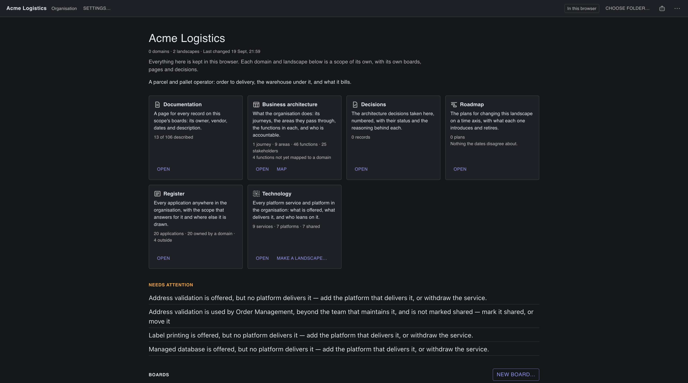
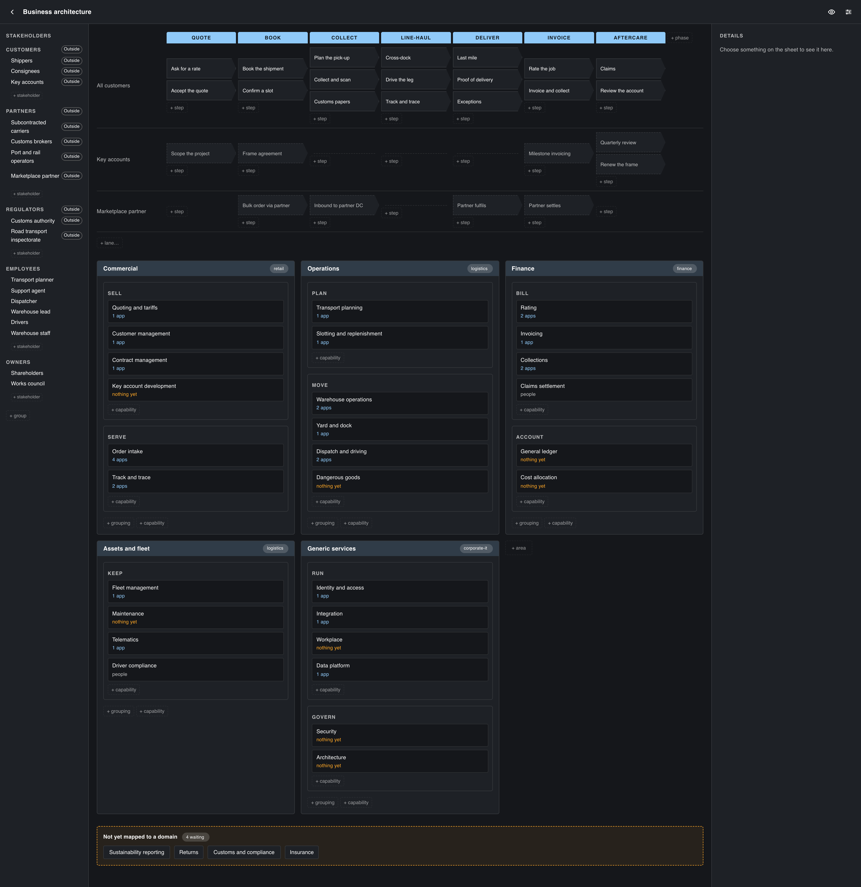

# Gebruikershandleiding

De Lionsville Architecture Management Tool tekent een applicatielandschap in
Layer 7-banden en de C4-containerdiagrammen eronder. Dit is de handleiding
voor het gebruik. Wat het is en waarom het bestaat staat in de
[README](../README.md); de Engelse versie van deze handleiding is
[manual.en.md](manual.en.md).

## Beginnen

**Desktop.** Download het installatiebestand voor je platform van de
[releasepagina](https://github.com/Lionsville/Lionsville-Architecture-Management-Tool/releases/latest).
De app kijkt op de achtergrond of daar een nieuwere versie staat en zegt het als
die er is — **Download…** opent het installatiebestand in je browser, **Skip
This Version** zegt deze niet, en het vinkje in dat venster zet de automatische
controle uit. Er installeert zichzelf niets. **Check for Updates…** in het
appmenu vraagt het op verzoek.

**Browser.** Vanuit een kloon van de repository eenmalig `npm run setup`, daarna
`npm run dev`; open <http://127.0.0.1:5200>. Waar de browser het aanbiedt —
Chromium doet dat — kan een tabblad net als de desktop in een map werken. Waar
dat niet kan, leeft alles wat je maakt in de opslag van die browser tot je een
bestand bewaart.

In beide gevallen verlaat niets je computer. Er is geen account, geen backend
en geen telemetrie.

## Het organisatiescherm

De app opent op de **organisatie** — de werkmap zelf, die een onderdeel is als
elk ander en waaronder al het andere valt. Een **onderdeel** is één document:
een naam, een landschap, de containerdiagrammen eronder, de besluiten, de
plannen, de bedrijfsarchitectuur en alles wat erop staat. Onderdelen
**nestelen**, en ze zijn allemaal hetzelfde document — de organisatie bovenaan,
een **domein** eronder, een **landschap** daar weer onder, zo diep als je werk
vraagt.



Het scherm is het thuis van de organisatie en geen lijst met documenten, en het
bestaat uit vier delen.

**Wie het is**, bovenaan: de naam, de klant als de tekeningen voor iemand anders
gemaakt zijn, hoeveel domeinen en landschappen eronder vallen, wanneer er voor
het laatst iets veranderde, de omschrijving en de koppelingen. Een map die nog
geen naam heeft vraagt er hier om in plaats van een lege kop te tonen.

**De eigen pagina's**, als vier kaarten. **Bedrijfsarchitectuur** telt de
klantreizen, gebieden, functies en belanghebbenden die de organisatie zelf
heeft, en zegt hoeveel functies nog aan geen enkel domein zijn toegewezen;
**Besluiten** telt de vastleggingen per status en noemt de nieuwste; **Roadmap**
telt de plannen en toont het eerste waarover hun datums het oneens zijn.
**Register** telt elke applicatie in de hele map, hoeveel er door een domein
worden beheerd en hoeveel van iemand anders zijn, en zegt waarover het register
het niet eens is. Elke kaart opent wat hij telt; als je de pagina sluit ben je
weer hier.

**De boom**, eronder: één regel per onderdeel, de kinderen ingesprongen, met een
pijltje om een domein dicht te klappen. Een regel zegt hoeveel erin zit —
landschappen en diagrammen over de hele tak voor een domein, diagrammen voor een
landschap — en wanneer het laatst iets veranderde. Daaronder draagt de regel,
waar er iets te melden is, zijn **bevindingen**: hoeveel namen twee onderdelen
allebei claimen, hoeveel kopieën verouderd zijn, en de rest van *Eén naam in de
hele organisatie* hieronder. **Volgorde** sorteert op naam of op wat je het
laatst hebt gewijzigd.

- **Openen** gaat een onderdeel in dat iets tekent. Een onderdeel dat niets
  tekent is een domein: alles wat eronder valt staat eronder, en er is geen bord
  om te tonen.
- **Nieuw onderdeel…** vraagt om een naam en om waaronder het valt. Elke regel
  heeft er zelf een, en dat is de snelle manier om er iets onder te hangen.
- **Instellingen…** op elke regel bevat de naam, wat het is (organisatie,
  domein, programma, landschap — een woord voor het scherm, er gedraagt zich
  niets anders), een klant, een omschrijving, koppelingen en **Ondergebracht
  bij**, waarmee je het verplaatst.
- **Verwijderen** haalt het onderdeel weg, met alles wat eronder valt: op de
  desktop de map, in de browser de records. Een werkbestand dat je elders hebt
  bewaard blijft staan. De organisatie zelf kun je niet verwijderen — dat is de
  map die je hebt geopend.

**Voorbeelden**, als laatste. Een voorbeeld in een lege map zonder naam
kopiëren maakt het voorbeeld *de* organisatie; kopiëren in een map die al iets
is zet het onder een eigen nieuw onderdeel. Hoe dan ook is het vanaf dat moment
van jou, en niets wat je doet raakt het voorbeeld zelf.

Hernoemen hernoemt alleen het label — waar iets staat is zijn adres, en
hernoemen is niet verplaatsen. Verplaatsen verandert het adres van het onderdeel
en van alles eronder, en laat de inhoud ongemoeid: elke verwijzing elders in de
map die naar iets in die tak wees, gaat in dezelfde stap mee naar het nieuwe
adres, zodat een verplaatsing geen spoor van verouderde kopieën achterlaat. Bij
het starten opent de app het onderdeel dat je open had.

Zes namen worden geweigerd, omdat de mappen van een onderdeel ze al gebruiken:
`diagrams`, `docs`, `decisions`, `transitions`, `images` en `logos`.

## Eén naam in de hele organisatie

Een naam betekent overal in je map hetzelfde. Het magazijnsysteem is één
systeem, welk domein het ook tekent, en een capability die de organisatie
benoemt is diezelfde capability waar een landschap hem verfijnt — dus elk ding
wordt **één keer** vastgelegd, in één onderdeel, en elk ander onderdeel dat het
gebruikt wijst naar datzelfde ding.

**Het onderdeel dat het vastlegt, beheert het.** Daar zitten de details: in
welke fase het is en op welke data, wie het beheert, welke leverancier, waarop
het draait, hoe volwassen het is. Verander daar iets en overal waar het
getekend wordt staat het nieuwe.

**Overal elders staat een verwijzing** — een kaart die het ding tekent zonder
het te beheren. Zo'n kaart toont de naam met een klein **uit …** eronder dat
zegt waar het echt is vastgelegd, en het detailpaneel zegt hetzelfde met een
knop om daarheen te gaan. De naam en die regel zijn kopieën en staan dus
alleen-lezen, net als alles wat de beheerder beantwoordt. Wat een verwijzing
wél mag dragen is **haar eigen beschrijving** — wat het ERP voor het magazijn
betekent is een andere pagina dan wat het ERP ís, en allebei zijn ze het
opschrijven waard. Net zo de kleur, de vorm en het icoon die je hem geeft, en
waar je hem op je eigen borden zet.

Welk onderdeel een ding beheert, wordt bepaald door **diepte**: het diepste
onderdeel dat het vastlegt. Die ene regel werkt beide kanten op, en dat is het
punt. Capabilities worden bij de organisatie vastgelegd en naar beneden
verfijnd, dus de organisatie houdt ze. Applicaties worden vastgelegd in het
landschap dat ze draait, dus een domein houdt de zijne — en een organisatie die
een applicatie alvast bij naam noemt, noemt een plaatshouder die opzij gaat
zodra iemand dieper het echte record schrijft.

### Wat een bevinding betekent

De app weigert hierover nooit een save. Hij leest de hele map bij het openen —
en opnieuw zodra de map onder je verandert — en meldt wat hij vindt. Elke regel
van de boom op het organisatiescherm draagt zijn eigen zin.

- **Conflict** — twee onderdelen op hetzelfde niveau leggen dezelfde naam vast.
  Iemand is halverwege een migratie, of twee teams noemden hetzelfde ding op
  dezelfde middag. Beide regels zeggen het, want geen van beide is de foute.
  Maak er één een verwijzing naar de ander van.
- **Verouderd** — de kopie van de naam klopt niet meer met hoe het beherende
  onderdeel het noemt, of dat onderdeel is verplaatst. **Bijwerken** schrijft de
  kopieën in één stap terug, en dat kun je ongedaan maken als al het andere.
- **Ongedefinieerd** — een verwijzing naar iets dat niets in de map vastlegt. De
  kaart wordt getekend en de regel blijft staan; wat ontbreekt is ergens een
  record om naar te wijzen.
- **Een losse regel** — een lijn die eindigt op iets dat niets in de map heeft.
  Blijft staan en wordt als stomp getekend, en verdwijnt nooit bij een save.
- **Een voorstel** — een capability die een domein benoemde en geen onderdeel
  erboven. Geen fout: het is een gesprek met het niveau erboven.
- **Zonder eigenaar** — een systeem dat als andermans is gemarkeerd zonder dat
  iemand heeft gezegd van wie.

Eén ding op die lijst is **informatie en geen fout**: een record dat geen enkel
bord in zijn eigen onderdeel tekent. Iets kan echt, beheerd en beschreven zijn
zonder al op iemands plaat te staan, dus het wordt apart geteld en nooit als
bevinding gekleurd.

### Het register

**Register** op het organisatiescherm is elke applicatie in de hele map, op één
pagina. Niets schrijft hem: hij wordt telkens uit de onderdelen zelf afgeleid
wanneer de map gelezen wordt, dus hij kan niet afwijken van wat de mappen zeggen
en er is geen lijst die twee domeinen tegelijk bewerken.

Elke regel zegt hoe de applicatie heet, **welk onderdeel haar beheert**, of ze
van iemand anders is en van wie, **in hoeveel onderdelen ze getekend is** (houd
de muis op het aantal voor de namen), en de bevindingen erover als kleine chips.
Het filterveld doorzoekt de naam, de sleutel en het onderdeel; **Op naam** en
**Op niveau** zijn de twee volgordes. **Openen** gaat naar het onderdeel dat de
applicatie beheert, met de kaart geselecteerd — daar kunnen haar details worden
gewijzigd.

Een regel waar twee onderdelen dezelfde naam vastleggen biedt **Koppelen…**: dat
opent het onderdeel waarvan de vastlegging moet wijken en vraagt het dáár, want
een vastlegging wordt alleen gewijzigd door het onderdeel dat haar heeft.

### Een vastlegging naar een ander onderdeel verplaatsen

Waar iets is vastgelegd is een keuze die je achteraf kunt wijzigen. Kies de kaart
en druk op **Verplaatsen…** in de inspector; het venster biedt aan welke van de
vier van toepassing zijn.

- **Koppelen** — de eigen vastlegging opgeven en verwijzen naar die van een
  ander onderdeel. Dit lost een conflict op, en het is wat een kaart nodig heeft
  die getekend is voordat iemand de echte vastlegging schreef. Dit onderdeel
  houdt zijn eigen beschrijving, zijn kleuren en waar de kaart op zijn borden
  staat; het geeft de details op, waar het andere onderdeel vanaf dan voor
  instaat.
- **Omhoog** — de vastlegging naar een onderdeel hierboven verplaatsen en hier
  een verwijzing achterlaten. Dat is wat een applicatie in een landschap nodig
  heeft als het domein erboven degene hoort te zijn die haar beheert.
- **Omlaag** — het omgekeerde: naar een onderdeel hieronder.
- **Overdragen** — naar elk ander onderdeel. **Hier een verwijzing achterlaten**
  staat standaard aan; zet je het uit, dan tekent dit onderdeel het ding
  helemaal niet meer.

De laatste drie schrijven **twee onderdelen**, dus ze vragen het eerst. Het
onderdeel waar het naartoe gaat wordt geschreven vóór dit onderdeel verandert, en
dat is met opzet: gaat er halverwege iets mis, dan staat de vastlegging op
*beide* plaatsen — een conflict dat je ziet en met **Koppelen** oplost — en niet
op geen van beide.

Daarom **stopt ongedaan maken daar**. ⌘Z neemt alles terug wat je sindsdien deed
en weigert dan die stap, met een regel die zegt waarom: maar de helft ervan staat
op de stapel van dit venster, en de andere helft is een bestand in een onderdeel
waar hier niemand voor spreekt. Verplaats de vastlegging opnieuw, de andere kant
op, om het terug te zetten.

Een verplaatsing wordt geweigerd, met de reden, als het onderdeel waar het
naartoe zou gaan de naam al beheert, als een verplaatsing omhoog een onderdeel
noemt waar dit niet onder valt, en als het verwijderen van de vastlegging dingen
die eronder vallen zonder ouder zou achterlaten.

## Je werkmap (desktop)

De eerste keer dat de desktop-app start vraagt hij om een **map om in te
werken**, en alles wat je maakt staat daar als bestanden die je kunt lezen:

```
<jouw map>/
  scope.json                          de organisatie: naam, klant, koppelingen
  acme-logistics/                     een onderdeel eronder
    scope.json                        hetzelfde bestand, een niveau dieper
    warehouse-landscape/              en nog een keer
      scope.json                      hoe het heet, en wat erin zit
      model.json                      de elementen en de lijnen ertussen
      diagrams/landscape.json         wat een aanzicht is
      diagrams/landscape.geometry.json     waar de elementen staan
      docs/warehouse.md               de omschrijving van een element, als tekst
      decisions/0007-one-writer.md    een besluit
      logos/own.svg                   een logo dat je hebt geüpload
```

Een map met een `scope.json` erin is een onderdeel, en de mappen daarbinnen die
er ook een hebben zijn de onderdelen eronder. Verplaats een map in je
bestandsbeheer en het onderdeel staat op zijn nieuwe adres; niets erin zegt waar
het thuishoort.

**Een map van een oudere versie opent gewoon.** De eerste keer dat deze versie
er een ziet zet hij de hele boom om — `project.json` en `group.json` worden
`scope.json` — en waar de map een git-repository is legt hij eerst vast hoe de
map eruitzag. Nog een keer draaien doet niets.

Er zit niets verstopt in de app. Zet de map in OneDrive, in Dropbox, op een
netwerkschijf of in een git-repository en hij gedraagt zich zoals alles daar.
**Wijzigen…** op het organisatiescherm brengt je naar een andere map; de mappen die je eerder
gebruikte staan in **File ▸ Open Recent Folder**, elk onder de naam die hun
organisatie zichzelf geeft.

Dat je werk bestanden zijn heeft twee gevolgen.

- **Iemand anders kan ze wijzigen.** Verandert een bestand onder je handen — een
  collega, een synchronisatiedienst, jijzelf op een andere machine — dan
  verschijnt een strook boven de plaat. Staat er niets open, dan biedt hij hun
  versie aan; staan er wijzigingen open, dan zegt hij dat beide kanten zijn
  veranderd en vraagt welke blijft. Hun versie wordt nooit ongevraagd
  overschreven.
- **Alles wordt geschreven zodra het verandert.** Drie seconden nadat je stopt
  met bewerken, als je het venster verlaat, en als je het sluit. Alleen de
  bestanden die echt veranderden worden herschreven, dus één element verplaatsen
  herschrijft één klein bestand en verder niets.

Een browsertabblad kan ook in een map werken, waar de browser dat aanbiedt —
maar de toestemming overleeft een herstart zelden en erom vragen vereist een
klik, dus een tabblad pakt een onthouden map alleen weer op als de toestemming
nog geldt en begint anders zonder iets te zeggen in de browseropslag. De desktop
is degene die moet kiezen.

## Geschiedenis (desktop)

Staat er **git** op de machine, dan kan de app een geschiedenis van je map
bijhouden. **Bewaren… ▸ Momentopname…** komt met een tekst die al geschreven is
uit wat je deed — "Warehouse Management gewijzigd, 3 elementen verplaatst" — en
die je kunt aanpassen voor hij wordt vastgelegd. De eerste keer vraagt hij of
je überhaupt geschiedenis wilt bijhouden; er gaat in geen van beide gevallen
iets van je machine af.

**Bewaren… ▸ Geschiedenis…** toont elke momentopname. Kies er een en je ziet wat
er sindsdien veranderde — applicaties erbij, weg en gewijzigd, koppelingen
getekend en doorgeknipt, besluiten genomen — met de geometrie als aantal in
plaats van als lijst, want een Tidy-ronde is één zin en vierhonderd gewijzigde
regels.

**De geschiedenis van één ding.** De keuzelijst bovenaan de pagina beperkt
haar tot een aanzicht, een beschrijving of een besluit: de lijst wordt de
momentopnames die dat raakten, en de veranderingen de regels die erover gaan.
Dezelfde pagina opent al beperkt via **Geschiedenis…** in het menu van een
aanzicht-tab, op de documentatiepagina en op de pagina van een besluit.

Een beschrijving is het enige onderwerp dat niet van één onderdeel is: een naam
betekent overal in de map hetzelfde, dus de pagina van een element staat waar
het is vastgelegd én overal waar een onderdeel het tekent en zegt wat het daar
betekent. De geschiedenis van dat element is de optelsom van die pagina's, en
een regel onder de keuzelijst noemt de onderdelen die gelezen worden.
Terugzetten blijft van dit onderdeel: het zet terug wat de pagina van dit
onderdeel zei, de andere horen bij die onderdelen.

**Terugzetten.** Met een momentopname gekozen maakt **Deze versie
terugzetten…** het aanzicht, de beschrijving of het besluit weer wat het toen
was; met het hele project in beeld doet **Het hele project terugzetten…**
hetzelfde voor alles. Terugzetten is een nieuwe wijziging bovenop alles wat
sindsdien gebeurde, geen stap terug: de geschiedenis blijft groeien, de
activiteitenlijst zegt *Aanzicht Warehouse teruggezet naar 3 sep*, ⌘Z maakt
het ongedaan, en de volgende momentopname legt het vast. De app biedt die
momentopname meteen aan. Een besluit dat aanvaard, afgewezen of vervangen is
blijft zoals het is — schrijf een nieuw besluit dat het vervangt — en een
teruggezet aanzicht laat elementen weg die niet meer bestaan, en zegt hoeveel.

**Labels.** **Label…** bij een gekozen momentopname geeft haar een eigen woord
— "Aan de directie getoond" — naast haar boodschap, nooit in plaats ervan. Een
label reist mee met de geschiedenis, zodat een collega hetzelfde merkteken op
dezelfde plek ziet, in deze app of in elke git-client. Twee labels met dezelfde
naam in één map worden geweigerd; kies een ander woord.

Zonder git biedt de app dit alles eenvoudigweg niet aan, en werkt de rest
precies zoals eerst.

## De werkruimte

Eén open project: een balk bovenin, de editor eronder.

| In de balk | Wat hij doet |
|---|---|
| **Projecten…** | Terug naar het organisatiescherm |
| **Instellingen…** | Naam van dit onderdeel en waaronder het valt, en zijn standaarden: de auteur op een geëxporteerd diagram, en de volwassenheidskolommen waar een nieuw landschap mee begint. Een onderdeel onder een ander zetten laat de inhoud met rust |
| **Bewaren…** | **Werkbestand** (`.lvarch`) is alles: geometrie, opmaak, eigen logo's, vastgezette routes — je projectmap in één bestand. **Interchange-document** is alleen topologie en semantiek, de vorm voor review en versiebeheer. Op de desktop biedt het menu ook **Momentopname…** en **Geschiedenis…** |
| **Openen…** | Laadt allebei, en herkent aan de inhoud van het bestand welke van de twee het is — niet aan de naam |
| **Activiteit** | Wat er sinds het openen aan dit project is veranderd — een lijst met benoemde stappen en het tijdstip van elke. Alleen lezen: ⌘Z is hoe je teruggaat |
| **Thema** | Licht, donker of systeem. Systeem volgt je computer en schakelt mee |
| **Bewaard · uu:mm** | Hoe het project ervoor staat: het tijdstip van de laatste schrijfactie, of **Nog niet bewaarde wijzigingen**, **Bezig met bewaren…**, **Gewijzigd op schijf**, **Hier én op schijf gewijzigd** |

Alles wordt vanzelf bewaard terwijl je werkt: drie seconden nadat je stopt, als
je het venster verlaat en als je het sluit — en sluiten met openstaande
wijzigingen vraagt eerst. In een browser zonder map zegt de app één keer dat de
opslag voor viervijfde vol zit — dat is de enige waarschuwing die je krijgt,
want een browser stopt zonder te vragen met bewaren. Weigert de opslag helemaal
(vol, of geblokkeerd in een privévenster) dan zegt de balk onderin dat één keer
en werkt de editor gewoon door; bewaar dan een werkbestand, want zonder opslag
is het project weg als het tabblad sluit. Elke melding (bewaard, geladen, mislukt) verschijnt in
die balk onderin.

**Taal.** De taalknop rechts in de werkbalk van de editor (hij toont de code
van de taal waarin je zit: NL, FY, DE of EN) opent een menu met de vier:
Nederlands, Frysk, Deutsch en English. Een keuze schakelt de hele interface om:
menu's, dialogen, tooltips, bandnamen, foutmeldingen en het titelblok van een
PNG-export. De eerste keer beslist de taal van de browser. Het ontwerp zelf
verandert niet; namen van elementen zijn inhoud, geen interface.

## Tekenen

**Het landschap** heeft vijf banden: actoren, invoerkanalen, externe systemen,
het applicatielandschap en de beheerlaag. Sleep een element uit het palet links
in een band, of rechtsklik op de plaat en kies **Hier toevoegen**. Banden
vergroot je door aan hun rand te slepen.

**Domeingroepen** zetten de applicaties die bij elkaar horen in één vak. Voeg er
een toe uit het palet of het plaatmenu, geef hem een kleur, sleep applicaties
erin, leg hem apart netjes. Een groep weghalen laat zijn elementen staan.

**Containerdiagrammen.** Dubbelklik op een applicatie om het containerdiagram
eronder te openen, of er een te maken. De applicatie wordt de grens van dat
diagram en haar componenten staan erin. De tabbladen bovenin tonen het
landschap en de containerdiagrammen eronder; rechtsklik een tabblad om te
hernoemen, te dupliceren, te verwijderen of de **diagraminstellingen** te
openen.

**Zoeken.** ⌘F / Ctrl+F opent de zoeker: typ een naam, categorie, leverancier
of technologie, Enter of een klik selecteert het element en de plaat schuift
ernaartoe, zo nodig eerst naar een ander diagram. Het palet heeft zijn eigen
zoekveld, in beide talen.

**Panelen.** Sleep de rand tussen een paneel en de plaat om het te verbreden of
te versmallen, dubbelklik de rand voor de standaardbreedte, klap een paneel
met de chevrons in tot een rail. De minimapknop in de werkbalk toont of
verbergt het overzichtskaartje.

**Toetsenbord.** Tab loopt langs de elementen op de plaat, Enter selecteert het
element onder de focus en Shift+Enter voegt het toe aan de selectie. De pijltjes
verplaatsen de selectie een rasterstap, met Shift één pixel. `?` toont alle
sneltoetsen.

## Elementen

Zeven soorten: applicatie, component, extern systeem, invoerkanaal,
beheertool, actor, en de domeingroep die ze bijeenhoudt. Selecteer er een en de
**inspector** rechts toont zijn velden in drie tabbladen.

- **Algemeen.** Naam, categorie, leverancier, technologie, levenscyclus
  (gepland, live, uitfaserend, uitgefaseerd; als badge, uitgefaseerde
  elementen dimmen), of je het beheert, de omschrijving (zie *Documentatie*) en
  waar het staat.
- **Vormgeving.** Accentkleur, vorm, pictogram, pictogramgrootte.
- **Gegevens.** De **volwassenheidsaspecten** van een applicatie: per kolom van
  dit diagram beheerd, deels, geen of risico, met een notitie. De kolommen
  stel je per diagram in bij de diagraminstellingen.

**Pictogrammen.** Ruim honderd ingebouwde tekens, doorzoekbaar op naam,
categorie en trefwoord in beide talen, in twee maten: klein in de kop, groot
voorop de kaart voor een plaat die van een afstand gelezen wordt. **Upload a
logo** in de kiezer voegt een eigen SVG of PNG toe (tot 200 kB). Geüploade
logo's reizen mee in het werkbestand, nooit in het interchange-document.

**Meer tegelijk.** Selecteer meerdere elementen en de inspector biedt
levenscyclus, kleur, pictogram en domeingroep voor allemaal, elk één stap in
Ongedaan maken.

**Soort wijzigen.** Rechtsklik een element, **Soort wijzigen ▸**, en kies wat
het had moeten zijn; koppelingen, omschrijving en plaats blijven. Twee gevallen
worden geweigerd, met de reden erbij: een applicatie met een containerdiagram,
en een component dat nog aan een applicatie hangt.

Elementen horen bij het model, niet bij een diagram: één element kan op
meerdere diagrammen staan, en **Uit dit aanzicht halen** is iets anders dan
**Uit het model verwijderen**. Verwijderen vraagt eerst, en zegt hoeveel
koppelingen meegaan.

## Koppelingen

Sleep van het handvat van een element naar een ander, of rechtsklik en kies
**Verbinding starten naar…**. Een koppeling heeft een label, een protocol (wat
je maar typt: REST, EDI, Kafka), een richting die de pijlpunten bepaalt, een
kleur en een lijnstijl. Dubbelklik het label om het ter plekke te bewerken.

Lijnen worden door een echte router om elementen heen gelegd en opnieuw gelegd
als er iets verschuift. Als automatisch niet is wat je wilt:

- Sleep een **pil** midden op een been om dat been te verschuiven, sleep een
  **vierkant** om een knik te verplaatsen; de route wordt handgetekend en de
  router laat hem met rust.
- **Knik toevoegen**, **Knik verwijderen**, **Terug naar automatische route**
  in het lijnmenu.
- **Route vastzetten** houdt een lijn precies zoals hij is, ook zonder knikken.
- **Aanhechten aan ▸** kiest aan welke kant van een element elk uiteinde
  vertrekt of aankomt, of houd Alt ingedrukt terwijl je een verbinding vanaf
  een specifiek zijhandvat sleept. Een gekozen zijde is een randvoorwaarde die
  de router respecteert, geen handgetekende route.
- Sleep het label van zijn standaardplek; **Labelpositie herstellen** zet het
  terug.

Op een heel druk bord — meer dan ongeveer honderdvijftig lijnen die om dezelfde
ruimte strijden — slaat het automatisch leggen over in plaats van er minuten
aan te besteden, en zegt dat in de balk onderin. Er gaat niets verloren: de
lijnen houden de routes die ze hadden, en alles wat je met de hand tekende
blijft precies zoals je het achterliet.

## Lay-out

**Tidy** legt het diagram automatisch, met een richting (dwars, omlaag, of
groepen dwars en hun applicaties omlaag), een dichtheid, en pinnen voor wat je
met de hand hebt neergezet. **Verbindingen leggen** tekent alleen de lijnen
opnieuw en laat elk element staan; **Alles opnieuw leggen** negeert pinnen.
Een domeingroep leg je apart netjes vanuit zijn menu.

Tidy werkt naast de app in plaats van erin, dus het venster blijft reageren
terwijl het loopt en de Tidy-knop is intussen een **Annuleren**. Op een diagram
van meer dan vierhonderd blokken slaat het over en zegt dat, in plaats van er
minuten over te doen: verdeel het bord over meerdere diagrammen, of leg één
domeingroep tegelijk netjes.

Met de hand: **uitlijnen** en **verdelen** van een selectie via de zwevende
werkbalk of het selectiemenu, een **raster** met optioneel uitlijnen, verplaatsen
met de pijltjes, **passend maken** (Shift+1) en 100 % (Shift+2).

## Documentatie

Elk element heeft een omschrijving in markdown, en die kan een hele pagina zijn.
Open hem als pagina met **Documentatie openen** in het elementmenu, de
uitklapknop naast het omschrijvingsveld in de inspector, Enter op het
geselecteerde element, of een dubbelklik op alles wat geen applicatie is.

De pagina opent om te **lezen**: het document met een inhoudsopgave, links de
andere elementen van het diagram om tussen te wisselen (een paginateken toont
wie al documentatie heeft), rechts de velden van het element zelf.
**Bewerken** zet de bron links en het resultaat ernaast, en maakt ook de velden
rechts bewerkbaar. ⌘B en ⌘I omhullen de selectie; Escape gaat eerst uit
Bewerken en dan uit de pagina. Wijzigingen worden bewaard na een korte pauze en
bij het verlaten, één stap in Ongedaan maken per pauze.

Een lege pagina kan **beginnen met het sjabloon**: een koptabel en de
gebruikelijke secties. De regel **Korte omschrijving** in die tabel is wat het
element op de plaat laat zien; zonder die regel is dat de eerste alinea.
`[[Naam]]` in de tekst wordt een koppeling naar dat element. Gewone koppelingen
openen buiten de app.

**Documentatie** in de bovenbalk opent de pagina van het geselecteerde element,
of van het eerste element op het diagram als niets geselecteerd is. Een
codeblok gemarkeerd als `mermaid` wordt op elke pagina als diagram getekend.

## Besluiten

**Besluiten** in de bovenbalk opent de architectuurbesluiten (ADR's): een boom
links, de besluiten van het gekozen knooppunt in het midden, en het besluit dat
u leest rechts.

De besluiten van dit onderdeel zijn **één lijst**. Een besluit hoort óf bij het
onderdeel als geheel, óf het gaat over één ding erin — een applicatie, een
capability, een stap in een klantreis — en de boom heeft een knooppunt voor elk
ding met besluiten, met elke applicatie erbij, of ze er nu al heeft of niet. Iets
dat uit het model is verdwenen houdt zijn besluiten onder *Verwijderde
applicaties*.

Daaronder komen de onderdelen **erboven**, elk als een eigen kopje: *Van Acme
Logistics*, *Van Retail*. Hun besluiten worden hier gelezen en **gewijzigd waar
ze thuishoren** — de lezer toont ze zonder knop om te bewerken en biedt aan dat
onderdeel te openen. De nummering is per onderdeel, dus ADR-0001 van het domein
en ADR-0001 van het landschap zijn twee besluiten, en dat waren ze altijd al.

Een besluit volgt het MADR-formaat: context en probleemstelling,
beslisfactoren, de overwogen opties, de uitkomst en haar gevolgen, de voor- en
nadelen van elke optie, meer informatie. **Nieuw besluit** vraagt de titel en
begint de tekst vanuit dat sjabloon. Titel, status, datum en besluitnemers zijn
velden boven de tekst; de tabel **beoordelaars en ondertekening** onderaan
noemt aan wie het besluit is voorgelegd, elk met een oordeel en de dag waarop
het gegeven is.

De status is een werkstroom, geen etiket. Een besluit begint als
**voorgesteld**, gaat naar **in beoordeling** en wordt dan **aanvaard** of
**afgewezen**. Die twee zijn het eindpunt: daarna kan het besluit niet meer
worden bewerkt of verwijderd, want een besluit dat achteraf herschreven kan
worden is geen vastlegging. Een aanvaard besluit kan later **vervangen**
worden; dat vraagt welk besluit het vervangt en toont de verwijzing in beide
richtingen. Een beoordeling kan terug naar voorgesteld.

Het zoekveld boven de lijst doorzoekt alle besluiten in de boom tegelijk —
titel, tekst en beoordelaars. De tekst is markdown, met dezelfde
`[[Naam]]`-verwijzingen als documentatie; **Hulp bij opmaak** naast de bron
toont de syntaxis, mermaid-diagrammen inbegrepen. Wijzigingen worden met dit
onderdeel bewaard.

## Tijd, en de dag die een bord toont

Elke applicatie kan **levenscyclusdatums** dragen naast haar levenscyclus: de dag
dat zij live gaat, de dag dat het uitfaseren begint, de dag dat zij weg is. Alle
drie zijn optioneel, en een applicatie zonder datums gedraagt zich precies zoals
altijd. Waar een datum verstreken is wint die van de opgeslagen levenscyclus: een
landschap dat drie jaar na de livegang nog "gepland" zegt, is een landschap dat
niemand heeft bijgewerkt.

Een koppeling kan een eigen **venster** dragen, *geldig vanaf* en *geldig tot*.
Vrijwel geen enkele heeft er een nodig: een lijn zonder venster bestaat zolang
beide uiteinden bestaan. De lijnen die er wél een nodig hebben zijn de tijdelijke
— een sync, een routeringsfaçade, een dubbele schrijfactie — en dat is precies de
hybride fase van een vervanging.

**Toont** op de diagrambalk zegt welke dag het bord tekent. Er staat *Vandaag*
tot u een dag kiest; daarna staat die dag er, opgelicht, zodat een bord met 2028
er niet uitziet als een bord van nu. Elke kaart tekent de fase waarin zij op die
dag verkeert, en een lijn met een venster verschijnt alleen daarbinnen. De dag
wijzigen is een gewone bewerking: één regel in Activiteit, en ⌘Z draait hem terug.

Zo maakt u een toekomstig diagram. Klik met rechts op een tab, kies **Dupliceren
per datum…**, kies een dag, en u heeft een tweede bord van hetzelfde landschap
zoals het er dan bij staat. Er is maar één model, dus de twee kunnen niet uit
elkaar lopen. Een geëxporteerde PNG van een gedateerd bord noemt de dag in de
titel.

**Vervangen door** benoemt de opvolger van een applicatie, en **Eigenaar** zegt
wie ervoor tekent. Eigenaar was een regel in het documentatiesjabloon; het is nu
een veld, zodat de controles van de roadmap een persoon kunnen noemen.

## De roadmap

**Roadmap** in de bovenbalk opent het landschap op een tijdas. Alleen wat een
datum heeft krijgt een regel, dus een landschap van vierduizend applicaties met
negen datums is een roadmap van een paar regels — de rest staat op het canvas,
waar het thuishoort. Elke regel is een reeks gekleurde stukken: gepland, live,
uitfaserend, weg. Een streep door elke regel markeert vandaag, en een tweede de
dag die het bord achter de pagina toont.

De schuifbalk bovenaan verplaatst dat bord. Sleep hem en het canvas erachter
volgt, zodat de tekening en de as het niet oneens kunnen zijn over welke dag
wordt besproken.

### Plannen

Een **plan** is hoe een verandering van het landschap wordt vastgelegd: een titel,
een status, het venster waarin het loopt, wie het bezit, de applicaties die het
invoert, uitfaseert of wijzigt, de besluiten waarop het steunt, de mijlpalen, en
een tekst in markdown. Plannen verschijnen als banden onder de applicaties op de
as, met een teken per mijlpaal. Kies er een en hij opent rechts.

Een plan loopt **concept → akkoord → loopt → gereed**, en kan vanuit elk daarvan
worden gestaakt. Anders dan bij een besluit kan elke stap terug, en een afgerond
plan blijft bewerkbaar: een besluit legt een moment vast, een plan beschrijft
werk. Wat het plan vorige maand zei staat in de historie van de map.

**Verschuiven…** verplaatst een plan met een aantal dagen — het venster, elke
mijlpaal, en de levenscyclusdatums van de applicaties die het invoert en
uitfaseert — in één stap, want een plan dat uitloopt is één ding dat gebeurde.

Elk plan is één markdownbestand in `transitions/` in uw projectmap, genummerd
vanaf `TR-0001`.

### De business case

De tekst van een plan kan een **business case** bevatten: een blok waarvan de
invoer een leesbare kasstroomtabel is, met de uitkomsten eronder uitgerekend.

````markdown
```business-case
currency: EUR
discount rate: 10%

| Line       | Year 0   | Year 1 | Year 2  |
| ---------- | -------- | ------ | ------- |
| Investment | -415 000 |        |         |
| Savings    |          | 25 000 | 125 000 |
```
````

Een negatief getal is geld eruit, een positief geld erin, en een lege cel is nul.
Daaronder berekent de app de netto en cumulatieve kasstroom, de netto contante
waarde bij het opgegeven percentage, de interne rentabiliteit, de terugverdientijd
in perioden, het rendement op de investering en de baten-kostenverhouding. Uw
tabel wordt nooit herschreven.

Een tweede tabel, `Criterion | Weight | Score`, geeft een gewogen score voor het
deel dat geen geld is — beoordeeld van één tot vijf, van een maximum dat de app
zelf afleidt in plaats van dat u het intypt. Alles daarbuiten hoort in een
besluit, met de afwegingen en de opties die u tegen elkaar hebt gezet.

**Business case toevoegen** in het bewerkvenster zet een leeg blok bij de cursor.

### Waarover de datums het oneens zijn

Onder de as staat een lijst met tegenstrijdigheden: een applicatie die uitfaseert
terwijl er nog koppelingen live zijn, een opvolger die pas komt nadat wat hij
vervangt weg is, een uitfasering zonder benoemde opvolger, een koppeling die nog
geldig is nadat een van haar uiteinden is uitgefaseerd, en een plan dat over zijn
einddatum heen is.

Het toont waar de datums elkaar tegenspreken. Het kan niet zien of een landschap
verouderd is — dat kan niets — en de pagina zegt dat onder de lijst.

## De bedrijfsarchitectuur

**+** bij de diagramtabs, dan **Bedrijfsarchitectuur**, maakt een **blad**: de
laag boven de applicaties, op één pagina. Een landschap zegt wat er draait en wat
met wat praat. Een blad zegt wat de organisatie doet, voor wie ze het doet, en
hoeveel ervan door software wordt ingevuld.

Een blad wordt *gelegd*, niet getekend. Er valt niets te slepen en er is geen
router: wat het toont zijn vier bomen — een klantreis, de gebieden eronder, de
capabilities daarbinnen, en de belanghebbenden langs de zijkant — en de pagina
wordt berekend uit hun volgorde en hun diepte. Het krijgt een tab naast de
borden, en het openen laat het canvas staan waar het stond, zodat de tekening
waaraan u werkte er nog is als u terugkomt.



### De klantreis, en de paden erdoorheen

Bovenaan loopt één **klantreis**: wat de organisatie doet, van begin tot eind. De
fasen zijn de kolommen, van links naar rechts te lezen, en onder elke fase staan
de stappen die erin gezet worden.

Eén klantreis is zelden één pad. Een stap kan een **rijstrook** noemen — de
belanghebbende wiens eigen pad het is — en het blad tekent een rij per strook
onder dezelfde fasen, het gemeenschappelijke pad eerst. Waar een strook aftakt en
waar hij weer aansluit staat nergens vastgelegd: het is de eerste en de laatste
fase waarin de strook een eigen stap heeft. Een fase binnen dat bereik waarin hij
er geen heeft wordt getekend als *zoals de rij hierboven*; daarbuiten wordt de
strook helemaal niet getekend. Niets kan het oneens zijn over waar een pad
weggaat en terugkomt, omdat niets anders dan de stappen het zegt.

Een stap die iemand buiten de organisatie zet — een partner die een order
afhandelt — wordt gemarkeerd als buiten de organisatie gedaan, zodat de pagina
kan zeggen dat een fase door niemand binnen wordt gedekt.

### Gebieden, en wat ze invult

Onder de klantreis staan de **gebieden**, elk met hun groeperingen en de
capabilities daarbinnen. De diepte is wat getekend wordt, en het model kent de
woorden niet: een item bovenaan is een gebied, een item daarin een groepering, en
een item daarin weer een capability.

Elke capability zegt wie hem invult:

- **een applicatie**, of meerdere — wat hem ondersteunt. Een capability met er
  twee waarvan er één uitfaseert is een migratie die u kunt zien.
- **mensen** — niemands software, iemands werk. Een volledig antwoord en geen
  gat: een pagina die dit als probleem tekende zou u aanraden software te kopen
  voor wat u met de hand doet.
- **nog niets** — geen van beide, en dát is het gat waarvoor je de pagina tekent.

Die staan in het model en niet op het kaartje: een capability is ingevuld omdat
iets in het landschap hem ondersteunt. **Ondersteund door…** in het paneel is
hoe die regel geschreven wordt, en zo'n ondersteuning kan een venster dragen
zoals alles met een datum, dus een capability die vanaf maart is ingevuld is
vanaf maart ingevuld.

Onderaan staat een band voor wat **nog niet aan een domein is toegewezen** — de
gebieden die nog aan niemand zijn gegeven. Dat is een bevinding, geen fout: een
lijst van wat de organisatie gezegd heeft te doen en nog niet gezegd heeft wie
het doet.

### Er een maken

Een blad op een project met niets boven de applicaties is leeg, en die lege
pagina biedt de twee plekken om te beginnen: **Nieuwe klantreis** en **Nieuw
gebied**. De rest is telkens een **+** op de plek waar het ding komt, en ze
werken allemaal hetzelfde — wat u maakt verschijnt, is gekozen, en de cursor
staat in de naam, dus u typt over wat het heette en drukt op Enter.

- **Nieuwe klantreis** maakt de klantreis én de eerste fase, *Begin*, en laat
  dit blad hem tekenen; een band die een kop is met niets eronder is niet wat u
  vroeg.
- **+ fase**, aan het eind van de faserij, zet er een kolom achteraan.
- **+ stap**, in elke cel, zet een stap in die fase op het pad van die rij.
- **+ baan…**, onder de laatste rij, vraagt wiens pad het is — een
  belanghebbende die u al hebt, of een naam die u typt, met de aantekening
  buiten de organisatie als dat zo is — en bij welke fase hij splitst, want een
  baan wordt getekend waar zijn stappen staan en een baan zonder stappen wordt
  niet getekend.
- **+ gebied**, na het laatste gebied, maakt er een en tekent hem vanaf dat
  moment op dit blad.
- **+ groep** en **+ capability** binnen een gebied, en **+ capability** binnen
  een groep. Een capability die rechtstreeks in een gebied gemaakt wordt is een
  kaartje in de kolom, en wordt een groep zodra er iets in gezet wordt.
- **+ belanghebbende**, naast een regel op de rail, zet er een onder; **+
  groep**, onderaan de rail, begint een eigen tak.

**Ondersteund door…** en **Gedaan door…** in het paneel zijn hoe een capability
ingevuld raakt: vink een applicatie aan en die ondersteunt hem, vink een team
aan en het is van hen. Elk vinkje is een eigen stap, en de regel onder de naam
van de capability verandert mee.

**Verwijderen**, onderaan het paneel, haalt weg wat gekozen is en elke regel die
erop uitkwam. Het wordt geweigerd zolang er iets in zit, met hoeveel erbij: er
cascadeert niets, dus een gebied dat u verwijdert is een gebied dat u eerst
leeggemaakt hebt.

**Wat dit blad tekent**, de schuifjes in de bovenbalk, gaat over het blad en
niet over het model — welke klantreis bovenaan loopt (een project met twee
klantreizen begint met geen van beide), welke gebieden getekend worden en in
welke volgorde, de volgorde van de banen, en of de rail er staat.

### Er een bewerken

Kies iets op de pagina en het opent rechts: de naam, de beschrijving, waar het
onder valt, waar het tussen zijn buren staat, wiens pad een stap is, of een
belanghebbende van buiten de organisatie is, en de levenscyclus van een
capability — een capability die gebouwd wordt is in dezelfde fase als een
applicatie die gebouwd wordt. Iets onder iets anders hangen wordt geweigerd als
het daarmee in zichzelf zou komen te zitten; die weigering staat in de lijst en
wordt er niet uit weggelaten. Het oog in de bovenbalk verbergt de
belanghebbenden.

Een applicatie openen vanuit de invulling van een capability brengt u naar een
bord dat hem ook echt tekent — desnoods een ander dan waar u stond — en naar de
eigen pagina van de applicatie als geen enkel bord hem tekent.

### De bedrijfskaart

**+** in de diagramtabs, dan **Bedrijfskaart**, maakt de tweede uitgelegde
weergave — of **Kaart** op de kaart *Bedrijfsarchitectuur* van het
organisatiescherm opent die van de wortel. Het is dezelfde laag, andersom
gelezen: elke functie onder elkaar, in de volgorde waarin het blad ze tekent en
ingesprongen naar diepte; een kolom per applicatie die de rijen noemen; een
markering waar de een de ander ondersteunt. Op een sectie — een gebied, een
groep — is de markering hol en betekent *iets hieronder*: het optelsel, zodat de
kop van een gebied zegt waar het hele gebied op leunt voordat u de capabilities
leest. Applicaties die een ander niveau bezit staan bovenaan gegroepeerd onder
de naam van dat niveau, want de systemen die de capabilities van de organisatie
ondersteunen zijn meestal die van een landschap, en een kolom die niet zegt van
wie hij is heeft de helft gezegd.

Twee kolommen komen laatst. **Mensen** is gemarkeerd waar iemand toegewezen is
— één kolom en niet één per belanghebbende, want "met de hand gedaan" is één
antwoord. **Dekking** is het gat: *ongedekt* bij een capability die niets en
niemand dekt, *mensen* bij een die met de hand gedaan wordt zonder systeem, en
bij een sectie hoeveel capabilities eronder ongedekt zijn. De bovenbalk telt de
drie op. Een kaart met een *per*-dag telt de rijen die op die dag gelden, dus
een systeem dat in maart iets gaat ondersteunen is op de kaart van februari een
gat.

Kies een rij en hij opent rechts, zoals op het blad — *Ondersteund door…*
inbegrepen, zodat een gat gedicht kan worden vanaf de pagina die het toont.
Kies een kolomkop om de applicatie te openen, waar dit niveau hem heeft.

## Zoeken

**Zoeken** in de bovenbalk, of ⌘K, doorzoekt het hele project in één keer:
elementen op naam, categorie, leverancier en technologie; documentatie op wat
erin geschreven staat; en besluiten op alle drie de niveaus, die van de groep
inbegrepen. Een element kiezen selecteert het en schuift ernaartoe, een
documentatietreffer opent de pagina van dat element, en een besluit opent de
vastlegging. ⌘F in de editor blijft de snelle zoeker als u alleen een blok op
het canvas zoekt.

## Diagraminstellingen

Rechtsklik een diagramtabblad, **Diagraminstellingen…**.

- **Op de tekening.** Auteur, opdrachtgever en datum voor het titelblok van een
  PNG-export — leeg gelaten vallen ze terug op de standaard van het project of
  de dag van export — en of het titelblok überhaupt getekend wordt.
- **Volwassenheidskolommen.** De aspectkolommen die applicaties op dit diagram
  dragen: voeg een standaardkolom toe (platform, CI/CD, DR, beveiliging,
  monitoring, back-up, compliance, kosten), voeg een eigen kolom toe, hernoem,
  herschik, of zet de badges helemaal uit. Een kolom hernoemen bewaart elke
  status die er al tegen is vastgelegd.

## Bewaren, exporteren, delen

Drie uitgangen, voor drie doelen.

- **Het werkbestand** (`.lvarch`) is alles, en is wat je aan iemand geeft die
  verder gaat bewerken. Het is je projectmap in één bestand — een zip — zodat
  iedereen het kan uitpakken en lezen zonder deze tool. Werkbestanden van
  eerdere versies openen gewoon.
- **Het interchange-document** draagt topologie en semantiek en geen geometrie
  of opmaak: een diff ervan laat zien wat er aan de architectuur veranderde,
  niet wat er op de plaat verschoof. Een ingebouwd pictogram reist mee als
  `iconType`; een geüpload logo niet. Wat deze tool in een document niet kent
  overleeft een rondreis ongewijzigd, en een document zonder pictogrammen komt
  woordelijk gelijk terug.
- **PNG-export** (de downloadknop) opent een dialoog met een voorbeeld van de
  plaat zoals die vertrekt: in het lichte of het donkere thema, los van wat er
  op het scherm staat, met elk lijnlabel of alleen de kale lijnen, met of
  zonder het titelblok onderaan — klant, auteur en datum — en met of zonder de
  legenda eronder, die zegt wat de badge- en levenscycluskleuren betekenen. De
  export van een containerdiagram draagt zijn C4-hoek in de strook: het niveau,
  de applicatie, een zin en de datum. Levenscyclusbadges kun je eerst uitzetten
  voor een schone plaat. Kon een logo niet worden ingebed, dan zegt de balk
  onderin welk. Een heel groot bord is tientallen megapixels en kost tijd om te
  tekenen, dus de dialoog zegt hoe groot de afbeelding wordt en de knop vraagt
  het eerst.

## Voorkeuren

Raster, uitlijnen op raster, levenscyclusbadges, ingeklapte panelen en hun
breedte, het overzichtskaartje, de Tidy-instellingen, de taal en het thema
worden per browser of per desktopinstallatie onthouden. Ze zijn van jou, niet
van het project: ze reizen niet mee in een bestand.

## Ongedaan maken

**⌘Z** dekt alles, in de volgorde waarin je het deed: een blok verplaatst, een
diagram hernoemd, een besluit aanvaard, een projectinstelling gewist. Een naam
typen is één stap in plaats van één per letter, en een sleep met de lijnen die
erna opnieuw worden gelegd is één stap — dus één keer terug geeft je wat je had,
niet wat je een toetsaanslag geleden had.

**Activiteit** in de bovenbalk toont die stappen met hun naam en tijd. Het is
een verslag, geen weg terug: naar een regel springen roept een vraag op ("en
alles daarna?") die ⌘Z al beantwoordt.

## Sneltoetsen om te kennen

| Toetsen | Doet |
|---|---|
| `?` | Alle sneltoetsen |
| ⌘F / Ctrl+F | Element zoeken |
| Enter | Documentatie van het geselecteerde element openen |
| F2 | Selectie hernoemen |
| Delete | Selectie weghalen, na navraag |
| ⌘Z, ⌘⇧Z | Ongedaan maken, opnieuw — één stapel over alles |
| ⌘C ⌘X ⌘V, ⌘D | Kopiëren, knippen, plakken, dupliceren |
| Pijltjes, ⇧Pijltjes | Verplaatsen per rasterstap, per pixel |
| Shift+1, Shift+2, `=`, `-` | Passend maken, 100 %, inzoomen, uitzoomen |
| Shift+F10 | Het menu voor de selectie |
| ⌘S / Ctrl+S | Nu bewaren |

Op Windows en Linux lees je Ctrl voor ⌘.
